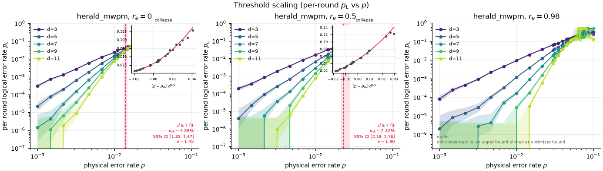
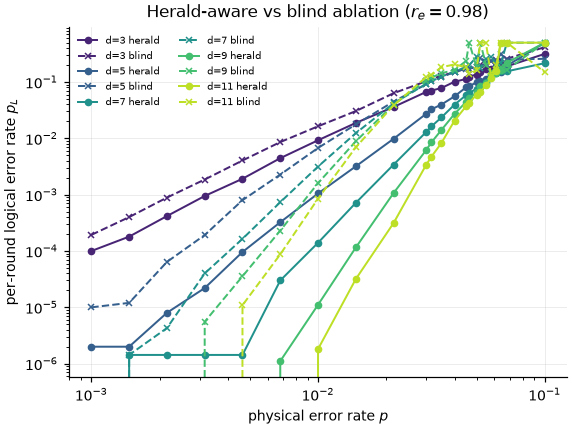
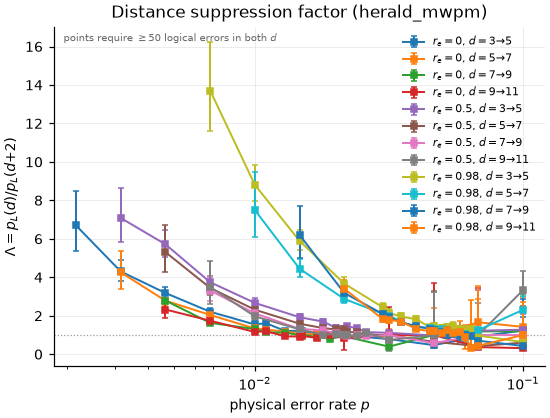

# Herald-Conditioned Decoding of the Erasure-Converted Rotated Surface Code

A distance-`d` rotated surface-code memory [[1]](#references) (Z basis, in
[Stim](https://github.com/quantumlib/Stim) [[2]](#references)) under **erasure conversion**: a fraction
`r_e` of each two-qubit gate's error budget becomes a *heralded erasure* — the hardware flags *which*
qubit was disturbed and *when*. This models **¹⁷¹Yb neutral-atom Rydberg gates** [[3,4]](#references) and
**dual-rail superconducting cavities** [[5,6]](#references). A **herald-conditioned matching decoder**
(PyMatching [[7]](#references), wrapped as a `sinter.Decoder`) zeros the conditioned edge's weight — a
heralded site has conditional error probability ½, so `ln((1−p)/p) = 0` and a correction routes through it
for free.

Everything here is a **Z-basis memory** threshold under a single observable — not a full X+Z circuit-level
threshold (see [Modelling assumptions](#modelling-assumptions)). The detailed statistical methodology,
audit history, and full diagnostics live in [`docs/AUDIT.md`](docs/AUDIT.md); this README states the
results and their caveats in short form.

**Headline (measured).** Holding the *per-gate error budget constant* across `r_e`, the gain from erasure
is almost entirely from **reading the herald bits**, not from the conversion itself:

- **Blind** decoding (discard the herald bits) barely moves the threshold from baseline to `r_e = 0.5`:
  **1.44% → 1.49%** (95% CI `[1.36,1.58]` → `[1.42,2.15]`).
- **Herald-conditioned** decoding lifts it: **1.38% → 2.32%** (`[1.33,1.47]` → `[2.18,2.76]`) — a
  **significant** separation (`Δ = blind − herald = −0.83%`, 95% CI `[−1.24,−0.66]`, excludes zero; see
  below). The advantage compounds with distance and erasure fraction (the
  [ablation](#the-herald-aware-vs-blind-ablation)): a Wilson-bounded **> 100×** at large `d`, `r_e = 0.98`.

At **`r_e = 0.98`** the collapse fit resolves **neither** threshold and the code says so (`resolved=False`):
the herald fit rails ν to its bound (not converged), and the blind fit converges but its 95% CI spans
`~[1.5, 8]%` — wider than the threshold itself, so it is not a resolved value. The near-full-conversion
story therefore leads with the deterministic ablation.



*Per-round `p_L` vs `p`, one curve per `d ∈ {3,5,7,9,11}`, one panel per `r_e`; dashed line = fitted
`d ≥ 7` threshold with its bootstrap CI. Unresolved fits carry no line ("no fit").*

> **Data status.** Figures are generated from the **committed real Monte-Carlo sweeps** in `data/`
> (`baseline_pauli.csv`, `erasure_r50.csv`, `erasure_r98.csv`), so every quoted threshold is reproducible.
> Pinned regression snapshots live at `tests/fixtures/real_*.csv`. Committed **synthetic fixtures**
> (`tests/fixtures/synthetic_*.csv`) drive the byte-stable plotting/analysis tests and are **not
> measurements** — they are generated from the same collapse variable the fitter inverts (one is
> deliberately adversarial and the fitter must *reject* it). Stale pre-fix sweeps are preserved untracked
> under `data/stale_old_model/`.

---

## Measured thresholds (`d ≥ 7` collapse fit)

95% bootstrap percentile CI, `n_boot = 1000`, `seed = 0`. A fit is only quoted as a threshold when the
code marks it `resolved` (converged **and** CI narrower than `p_th`).

| `r_e` | herald `p_th` [95% CI] | blind `p_th` [95% CI] | χ²/dof (h/b) | note |
|---|---|---|---|---|
| 0.0 | **1.38%** `[1.33,1.47]` (ν=1.45) | **1.44%** `[1.36,1.58]` (ν=2.12) | 1.02 / 1.15 | control: no heralds → decoders agree within CIs |
| 0.5 | **2.32%** `[2.18,2.76]` (ν=1.90) | **1.49%** `[1.42,2.15]` (ν=1.58) | 0.62 / 0.47 | herald above blind — separation **significant**, see Δ |
| 0.98 | **not resolved** (ν-pinned) | **not resolved** (CI `~[1.5,8]`) | — / 0.20 | fit resolves neither; use the ablation |

**Is the `r_e = 0.5` separation significant? Yes — and comparing the marginal CIs above is not how you
test it** (`var(Δ)` is not the sum of the marginal variances). The valid test is a bootstrap of the
difference `Δ = p_th(blind) − p_th(herald)`: **Δ = −0.83%, 95% CI `[−1.24, −0.66]`, excludes zero**, stable
across seeds (control `r_e = 0` gives Δ consistent with zero). Two caveats, both worked out in full in
[`docs/AUDIT.md`](docs/AUDIT.md#paired-decoder-separation-phase-4): (i) the sweeps are sampled
*independently* per decoder, so this is an *unpaired* difference bootstrap — which can only be wider than a
paired one, making the result **conservative**; (ii) the CI conditions on both decoders converging, and
the ~10% discards are **not missing-at-random** (they cluster at high blind `p_th`), but a tipping-point
bound shows the claim survives — the upper endpoint reaches zero only if ≥ 24 of the 102 discards had
`Δ ≥ 0`, while their recorded `p_th` imply `Δ ≥ 0` for only 2. So: significant *conditional on
convergence*. The [ablation](#the-herald-aware-vs-blind-ablation), which needs no fit, is the primary
evidence.

### Comparison to the literature

Wu et al. [[3]](#references) report thresholds rising **0.937% → 4.15%** at 98% conversion. Ours are
consistent in structure and comparable at low `r_e` (baseline 1.38% vs 0.937%), but we deliberately **do
not** claim a matching 98% number: our `d ≥ 7` herald fit does not resolve at `r_e = 0.98`, **and** the
axes differ — our `r_e` is the *2q-gate* fraction, their `R_e` the fraction of *all* errors (only ~55% of
our circuit-wide DEM mass is heralded at `r_e = 0.98`, below). Remaining differences (noise apportionment,
finite-size drift, the uniform-sweep `p_meas=p_reset=p_idle=p` choice) are detailed in
[`docs/AUDIT.md`](docs/AUDIT.md).

### Where the gain comes from

With the budget held constant, the split is the *opposite* of an "erasure is intrinsically cheaper"
intuition. **Erasure conversion alone** (blind) moves the threshold `1.44% → 1.49%` from `r_e = 0` to
`0.5` — close to a wash. **Herald-conditioned decoding** is where the benefit lives: `1.38% → 2.32%`, and
the growing sub-threshold suppression below. We make **no causal claim** about *why* blind barely helps
(both channels are Pauli; "depolarizing is cheaper to correct" would be hand-waving) — the old
`1.6×`-blind / `2.7×`-herald decomposition was an artifact of the pre-fix budget-shrinking model and does
not survive (re-derivation in [`docs/AUDIT.md`](docs/AUDIT.md)).

---

## Noise channels (§5)

The erasure model follows Wu et al. [[3]](#references). `HERALDED_ERASE` is **unbiased** — `I/2`, all four
Paulis equal (the advantage is from decoding, not Pauli bias). Per two-qubit gate on `(a, b)`:

| Channel | Rate | Where |
|---|---|---|
| `DEPOLARIZE2` | `p·(1 − r_e)` | on `(a, b)` — residual Pauli |
| `HERALDED_ERASE` | `(2/3)·p·r_e` | on `a`, and independently on `b` — appends a herald bit |
| `X_ERROR` / `X_ERROR` / `DEPOLARIZE1` | `p_meas` / `p_reset` / `p_idle` (`= p`) | before `M`/`MR`, after `R`, on idle qubits |

The `(2/3)·p·r_e` rate (an erasure is non-identity only ¾ of the time, so `2·q·¾ = p·r_e`) holds the
per-gate non-identity budget at `p` for **every** `r_e` (tested by `test_error_budget_invariance`), so
`r_e` *converts* the budget rather than shrinking it and `p` is itself the iso-noise axis. Detector algebra
is standard; the one novelty is that **herald detectors carry a 4th sentinel coordinate `(x, y, t, 1)`**
the DEM partition splits on ([PLAN.md](PLAN.md) §3.4). Per-round conversion, the finite-size ansatz, and
the bootstrap/guard details are in
[`docs/AUDIT.md`](docs/AUDIT.md#threshold-fitting-methodology-reference).

> **`r_e` is the 2q-gate fraction, not the circuit-wide heralded fraction.** Meas/reset are never
> converted (idle only if `convert_idle`), so the fraction of *total DEM error mass* heralded is well below
> `r_e` — this, not `r_e`, is what compares to Wu et al.'s `R_e`. Measured by
> `scripts/heralded_fraction.py` at `d = 5, p = 0.02`: gate-only **0.30 / 0.55** at `r_e = 0.5 / 0.98`
> (0.42 / 0.72 with `convert_idle`). The committed sweeps use gate-only, so `r_e = 0.98` heralds **55%** of
> the mass, not 98%.

---

## The herald-aware vs. blind ablation



Same shots, two decoders: `herald_mwpm` reads the herald bits and zeroes the conditioned edges;
`blind_mwpm` strips the herald columns and folds erasures into static depolarizing noise. This is
decoder-vs-decoder **on identical shots** — independent of noise normalisation, needs no fit — the most
robust result here. **The ablation is paired by construction** (`scripts/ablation_table.py` samples once
and decodes the same `dets` with both decoders); the sinter *threshold sweeps* are not (sampled per
decoder), which is why the Δ test above uses an unpaired bootstrap while the ablation needs none.

**Forced-erasure correctness (M6 test).** With probability-1 probe erasures on `(1,3)`/`(1,5)`, a
double-X event produces a syndrome (single detector `D(2,2,1)`) indistinguishable from a single X on
`(1,1)` (on the logical support). Blind takes the cheaper one-edge route and **flips the logical**;
herald-aware sees both erased edges at weight 0 and does not. On 2048 shots blind fails ~475 times,
herald 0.

### Sub-threshold suppression

`p_L(blind) / p_L(herald)` at fixed sub-threshold `p = 1.0%`, by distance (`scripts/ablation_table.py`,
100 000 shots, seed 0). One statistical standard across the repo: cells below the **≥ 50 observed-error
gate** the Λ figure uses are reported as a Wilson lower bound `> N×`, not a point ratio.

| `d` | `r_e = 0.5` | `r_e = 0.98` |
|---|---|---|
| 3 | 1.3× | 2.1× |
| 5 | 1.9× | 8.8× |
| 7 | 2.8× | 41.2× |
| 9 | 4.1× | **> 106×** † |
| 11 | 6.4× | **> 352×** † |

*† Below the 50-error gate (herald errors: `d = 9` → 23, `d = 11` → 3 in 100 000 shots at `r_e = 0.98`):
Wilson lower bound, not a point value. The advantage compounds with both distance and erasure fraction.*

---

## Distance suppression (Λ factor)



`Λ = p_L(d) / p_L(d+2)` at fixed `p`, with bootstrap CIs; `Λ > 1` below threshold means distance helps, and
larger `r_e` gives larger `Λ`. Points are shown only where **both** distances have ≥ 50 observed errors
(the same gate as the suppression table); the low-statistics tail is dropped.

---

## Modelling assumptions

This is an idealized erasure model. Each assumption below is **systematically optimistic** — a real device
is worse in each respect — so the thresholds and suppression ratios here are upper bounds on what this
scheme delivers in hardware, not predictions of it.

- **Erasure is injected *after* the CX, independently per qubit.** There is no mid-gate erasure that
  propagates through the remainder of the gate, and no correlated two-qubit erasure — the two qubits of a
  gate erase independently. Real leakage happens *during* the gate and can corrupt both qubits together.
- **The erased qubit keeps participating perfectly in all later rounds.** `HERALDED_ERASE` replaces the
  qubit with `I/2` for that instant only; it is a fully-functional qubit again on the next tick. A real
  ¹⁷¹Yb erasure is an atom *leaked out of the qubit subspace* — it stays broken until physically
  re-prepared, so a single erasure should degrade many subsequent rounds, which we do not model.
- **Heralds are perfect.** Instantaneous, 100% reliable, zero false positives, zero latency. Real
  fluorescence heralding has finite fidelity, false positives/negatives, and a latency the decoder would
  have to tolerate.
- **The erasure is unbiased.** `HERALDED_ERASE` is `I/2` (all four Paulis equal). The Z-biased leakage of
  Sahay et al. [[8]](#references) would give a *further* threshold advantage that we deliberately do not
  model; our advantage is from herald-conditioned decoding alone.
- **Z-memory only, single logical observable.** Every "threshold" here is the **Z-basis memory** threshold
  under a single observable — not a full X+Z circuit-level threshold, and not a logical-gate or computation
  threshold. Read every number in this repo with the "Z-memory" qualifier attached.

---

## Caveats and limitations

- **Neither `r_e = 0.98` threshold is measured.** The large codes saturate to ½ within one grid step above
  the ~6% crossing, so the herald fit rails ν to its bound and the blind fit's CI is wider than its own
  `p_th`; both are `resolved=False` in code. Resolving them needs a denser, higher-statistics `p`-grid
  (future work). The ablation is the robust high-`r_e` result.
- **The effective crossing drifts with distance** (+0.33% at `r_e = 0`, larger at higher `r_e`), so every
  threshold uses the asymptotic `d ≥ 7` fit, which drops `d ∈ {3,5}`.
- **ν is only weakly constrained at `d ≤ 11`** (three large distances, coarse grid); `p_th` is far better
  determined than `ν`, and the fit reports χ²/dof so this is visible.
- **`estimate_crossing` is unreliable on saturated data**; it only seeds the fit window, and every quoted
  threshold comes from the `d ≥ 7` collapse fit, never the raw crossing estimate (mechanism in
  [`docs/AUDIT.md`](docs/AUDIT.md#threshold-fitting-methodology-reference)).

---

## Other components

- **Hook regression** (`figures/hook_regression.png`, §3.2). `shortest_graphlike_error()` vs `d` from the
  builder (no Monte Carlo): the hook-safe CX schedule keeps graphlike distance tracking `d`, a deliberately
  broken one halves it to `⌈(d+1)/2⌉` — the regression test that the scheduling logic matters.
- **DEM hand-verification.** The DEM partition was verified by hand on the `d=3, T=2` instance and
  reconciled against Stim (incl. a non-obvious two-erasure/one-detector cancellation):
  [`docs/dem_worksheet.md`](docs/dem_worksheet.md).
- **Decoder throughput** (two-tier dispatch): herald-free shots batch on the base matcher (~80k shots/s,
  `d=5, p=3e-2`); heralded shots group by fired-herald signature (~1,650 shots/s at `r_e = 0.98`), a 48×
  gap after replacing a per-shot matcher rebuild.

---

## Architecture

```
src/erasure_qec/
├── config.py              # frozen NoiseParams / ExperimentConfig (+ YAML I/O)
├── circuits/              # layout.py (pure geometry), scheduling.py (CX schedules), builder.py (emits stim)
├── noise/                 # model.py (NoiseParams -> channel rates), injector.py (Null/PauliOnly/Erasure)
├── decoding/              # dem_partition.py [§6], herald_matching.py [§8], sinter_adapter.py [§9]
└── analysis/              # statistics.py, threshold_fit.py, synthetic.py, dem_stats.py, plotting.py [§10]
experiments/               # collect_threshold_sweep.py, collect_lambda_scan.py, make_synthetic_fixtures.py, configs/
scripts/                   # audit_checks.py, ablation_table.py, heralded_fraction.py, paired_separation.py
```

Built milestone-by-milestone (M0–M9); see [PLAN.md](PLAN.md) for the full spec and
[`docs/AUDIT.md`](docs/AUDIT.md) for the audit that drove the noise-model and threshold-fit corrections.

---

## Reproducing

```bash
uv sync --group dev
uv run pytest -q                  # full suite (a few slow Monte-Carlo tests)
uv run pytest -m "not slow" -q    # fast lane

# regenerate every figure from the committed sweeps (byte-stable):
uv run python -m erasure_qec.analysis.plotting --data-dir data --figures-dir figures

# reproduce the analyses:
uv run python scripts/audit_checks.py        # docs/AUDIT.md table (pre-fix expectations vs HEAD)
uv run python scripts/ablation_table.py      # sub-threshold suppression, direct from circuits
uv run python scripts/heralded_fraction.py   # circuit-wide heralded fraction vs r_e
uv run python scripts/paired_separation.py   # threshold-difference (Delta) significance + discard diagnostics
```

Re-collecting the real sweeps is resumable (remove `data/<name>.csv` first to start clean); rough
wall-clock on 8 cores is ~10–20 min (`baseline_pauli`), ~1–2 h (`erasure_r50`), ~4–8 h (`erasure_r98`,
slow-path dominated). Regenerate synthetic fixtures with
`uv run python experiments/make_synthetic_fixtures.py`.

## References

Future directions (imperfect/delayed heralds, other hardware, logical algorithms, alternative decoders,
and a denser high-`r_e` sweep to resolve the `r_e = 0.98` herald threshold) are in
[`docs/FUTURE_WORK.md`](docs/FUTURE_WORK.md).

1. Tomita & Svore, *Low-distance surface codes under realistic quantum noise*,
   [arXiv:1404.3747](https://arxiv.org/abs/1404.3747)
2. Gidney, *Stim*, [arXiv:2103.02202](https://arxiv.org/abs/2103.02202)
3. Wu, Kolkowitz, Puri & Thompson, *Erasure conversion … in alkaline-earth Rydberg atom arrays*,
   [arXiv:2201.03540](https://arxiv.org/abs/2201.03540)
4. Ma et al., *High-fidelity gates and mid-circuit erasure conversion in an atomic qubit*, Nature 622 (2023)
5. Kubica et al., *Erasure Qubits*, [arXiv:2208.05461](https://arxiv.org/abs/2208.05461)
6. Teoh et al., *Dual-rail encoding with superconducting cavities*,
   [arXiv:2212.12077](https://arxiv.org/abs/2212.12077)
7. Higgott & Gidney, *Sparse Blossom*, [arXiv:2303.15933](https://arxiv.org/abs/2303.15933)
8. Sahay, Jin, Claes, Thompson & Puri, *High-Threshold Codes for Neutral-Atom Qubits with Biased Erasure
   Errors*, [arXiv:2302.03063](https://arxiv.org/abs/2302.03063)
9. Dennis, Kitaev, Landahl & Preskill, *Topological quantum memory*,
   [arXiv:quant-ph/0110143](https://arxiv.org/abs/quant-ph/0110143)
10. Fowler, Mariantoni, Martinis & Cleland, *Surface codes*, PRA 86, 032324 (2012)
11. Wang, Harrington & Preskill, *Confinement-Higgs transition …*,
    [arXiv:quant-ph/0207088](https://arxiv.org/abs/quant-ph/0207088)

## License

MIT — see [LICENSE](LICENSE).
