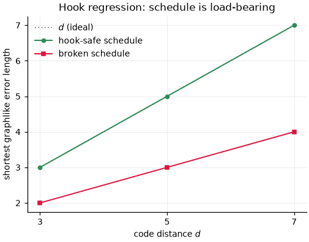

# Herald-Conditioned Decoding of the Erasure-Converted Rotated Surface Code

This repo studies **erasure conversion** in a distance-`d` rotated surface-code memory [[1]](#references)
(Z basis, in [Stim](https://github.com/quantumlib/Stim) [[2]](#references)): a fraction `r_e` of each
two-qubit gate's error budget is turned into *heralded erasures* — the hardware flags *which* qubit was
disturbed and *when*, rather than letting the error pass silently. This models **¹⁷¹Yb neutral-atom
Rydberg gates** [[3,4]](#references) and **dual-rail superconducting cavities** [[5,6]](#references),
where leakage and photon-loss events are natively detected. A heralded error is far easier to correct
than a blind one: knowing its location lets a **herald-conditioned matching decoder**
(PyMatching [[7]](#references), wrapped as a `sinter.Decoder` [[2]](#references)) zero that edge's
weight — a heralded site has conditional error probability ½, so `ln((1−p)/p) = 0` and a correction
routes through it for free.

**Headline result (measured).** Holding the *per-gate error budget constant* across `r_e` (so `r_e`
converts errors rather than removing them — see [Noise channels](#noise-channels-5)), the improvement
from erasure comes almost entirely from **reading the herald bits**, not from the conversion itself:

- The **blind** decoder (which discards the herald bits and folds erasures into extra depolarizing
  noise) barely moves the threshold from baseline to `r_e = 0.5`: **1.44% → 1.49%** (95% CIs
  `[1.36, 1.58]` → `[1.42, 2.15]`).
- The **herald-conditioned** decoder lifts it substantially over the same range: **1.38% → 2.32%**
  (`[1.33, 1.47]` → `[2.18, 2.76]`) — a **significant** separation (the difference
  `Δ = blind − herald = −0.83%`, 95% CI `[−1.24, −0.66]`, excludes zero; comparing the marginal CIs above
  is *not* the right test). The advantage compounds with code distance and erasure fraction (the
  [ablation](#the-herald-aware-vs-blind-ablation)) — reaching a large factor at `d = 11, r_e = 0.98`.

At **`r_e = 0.98`** the collapse fit resolves **neither** decoder's threshold: the herald crossing sits
near ~6% but the largest codes (`d = 9, 11`) saturate to the ½ coin-flip limit within one grid step above
it, so the `d ≥ 7` fit does not converge (ν rails to its bound); and the blind fit, though it returns a
point value ~1.6%, has a 95% bootstrap CI spanning `[1.5, ~8]%` (the crossing is bistable under
resampling). Both are reported as **non-results**, and the near-full-conversion story leads with the
deterministic ablation instead. All CIs here are 95% *bootstrap percentile* intervals from a bootstrap
that re-runs the whole pipeline per replicate (see [ansatz](#finite-size-scaling-ansatz-10)); they are
wider and more honest than the `± σ` an earlier version reported. That earlier "6.27% ± 0.54%" headline
was an artifact of a bug that reported a bound-pinned fit as converged, on a noise model whose per-gate
budget shrank with `r_e` (see [`docs/AUDIT.md`](docs/AUDIT.md)).


*Per-round `p_L` vs physical error rate `p`, one curve per distance `d ∈ {3,5,7,9,11}`, one panel per
erasure fraction; the dashed line is the fitted threshold (`d ≥ 7` collapse fit) with its bootstrap CI.
The `r_e = 0.98` herald panel carries no line — the fit does not converge (annotated "no fit").*

> **Data status.** These figures are generated from the **real Monte-Carlo sweeps committed in `data/`**
> (`baseline_pauli.csv`, `erasure_r50.csv`, `erasure_r98.csv`), collected under the fixed noise model.
> Every threshold quoted here is reproducible from that committed data by the code in this repo. The
> stale pre-fix sweeps are preserved (un-tracked) under `data/stale_old_model/`. Pinned real snapshots
> for deterministic regression live at `tests/fixtures/real_*.csv`. Separate committed
> **synthetic fixtures** (`tests/fixtures/synthetic_*.csv`) drive the byte-stable plotting/analysis tests
> — these are **not measurements**: they are generated from the same collapse variable the fitter
> inverts, so a fit recovering their injected `p_th` only confirms the fitter inverts its own model (one
> is deliberately adversarial, `synthetic_adversarial.csv`, and the fitter must *reject* it).

---

## Threshold scaling

The panels above are per-round logical error rate `p_L` vs physical error rate `p`. Each converged
panel's dashed line (with bootstrap CI band) is the fitted threshold `p_th` from the **asymptotic
`d ≥ 7` collapse fit** (see [Caveats](#caveats-and-limitations)); the inset is the collapse onto the
single scaling variable `x = (p − p_th)·d^{1/ν}`.

### Measured thresholds (`d ≥ 7` collapse fit)

`p_th` is the point estimate; the interval is a **95% bootstrap percentile CI** (default `n_boot = 1000`,
`seed = 0`; the full-pipeline bootstrap below, so the intervals are asymmetric and honest).

| `r_e` | `herald_mwpm` `p_th` [95% CI] | `blind_mwpm` `p_th` [95% CI] | χ²/dof (h / b) | notes |
|---|---|---|---|---|
| 0.0 | **1.38%** `[1.33, 1.47]` (ν = 1.45) | **1.44%** `[1.36, 1.58]` (ν = 2.12) | 1.02 / 1.15 | control: no heralds, so the decoders agree within CIs (as required) |
| 0.5 | **2.32%** `[2.18, 2.76]` (ν = 1.90) | **1.49%** `[1.42, 2.15]` (ν = 1.58) | 0.62 / 0.47 | herald above blind; the separation is **significant** — see Δ below |
| 0.98 | **not resolved** (fit non-converged) | **not resolved** (`[1.5, ~8]`, bistable) | 0.55 / 0.20 | at near-full conversion the collapse fit resolves neither threshold |

**Is the `r_e = 0.5` separation significant? Yes — but the marginal CIs above are not how you test it.**
Whether two marginal 95% CIs overlap is **not** a valid significance test (`var(Δ)` is not the sum of the
marginal variances). The correct statistic is a bootstrap of the difference
`Δ = p_th(blind) − p_th(herald)` itself (`bootstrap_threshold_difference`; run `scripts/paired_separation.py`):

| `r_e` | Δ = blind − herald | 95% CI | excludes 0? |
|---|---|---|---|
| 0.0 (control) | +0.06% | `[−0.04, +0.20]` | **no** (consistent with zero, as it must be with no heralds) |
| 0.5 | **−0.83%** | `[−1.24, −0.66]` | **yes** — herald threshold is significantly above blind |

The Δ CI at `r_e = 0.5` excludes zero comfortably and is stable across seeds (endpoints move < 0.04%), so
the separation is significant at 95%, not marginal. Two things to be straight about, both in full in
[`docs/AUDIT.md`](docs/AUDIT.md):

- **This is an *unpaired* difference bootstrap, and that makes the CI conservative.** The sweeps are
  sampled independently per decoder (differing shot counts; `sinter` samples each decoder separately —
  see [the ablation](#the-herald-aware-vs-blind-ablation)), so the positive correlation that shared shots
  would give (which cancels in Δ) is absent (measured ≈ 0.04). An unpaired difference bootstrap can only
  be *wider* than a paired one, so clearing zero under it is if anything a **stronger** result — the
  verdict did not lean on an assumption that turned out to be unavailable.
- **The Δ CI is conditioned on both decoders converging, and at `r_e = 0.5` the ~10% discards are *not*
  missing-at-random.** They cluster at high blind `p_th` (99% are bound-pinning of a bistable blind
  crossing), i.e. the replicates with Δ nearest zero, which nudges the CI away from zero. Rather than
  impute them (arbitrary — an [earlier imputation](docs/AUDIT.md) turned out too weak to trust), we bound
  it: the CI's upper endpoint reaches zero only if **≥ 24 of the 102 discards** would have given Δ ≥ 0,
  whereas the `p_th` those discards *did* record (101 of 102 fit both decoders — one converged, one
  bound-pinned; none are unbounded) imply Δ ≥ 0 for **only 2** of them. A discard would need blind's
  `p_th` to reach herald's centre 2.37%; the recorded failed-blind median is 1.80% and only 2 reach it.
  So the honest claim is: *significant conditional on convergence, discards not missing-at-random, but the
  tipping point (24) sits far above the recorded partial-information count (2).* The `r_e = 0` control is
  clean (discards missing-at-random; its Δ already includes zero).

The [ablation](#the-herald-aware-vs-blind-ablation) remains the primary evidence, since it needs no fit —
and no convergence filtering — at all.

At `r_e = 0.98` neither `d ≥ 7` fit yields a usable threshold: the herald fit returns `converged=False`
(ν pinned at its bound — `d = 9, 11` saturate to ½ within one grid step above the ~6% crossing), and the
blind fit, though it returns a point value ~1.6%, has a 95% CI spanning ~`[1.5, 8]%` that shifts with the
bootstrap seed — its crossing estimate is bistable, so the number is not trustworthy. The high-`r_e`
evidence is the [ablation](#the-herald-aware-vs-blind-ablation), which needs no fit.

All quoted intervals are 95% bootstrap percentile CIs (see [ansatz](#finite-size-scaling-ansatz-10)).
The `r_e = 0.98` blind fit has only 9 in-window points (χ²/dof = 0.20, a small-sample over-fit flag) and
a CI that both spans ~`[1.5, 8]%` and moves with the seed, so its ~1.6% point value is not a resolved
threshold. The `r_e = 0.98` herald fit is a non-result by construction: `fit_threshold(..., d_min=7)`
returns `converged=False` with `nu at upper bound`. The all-`d` fit "reaches" ~6–8.5% depending on the
window, but mixes the finite-size-corrected small distances and rests on ragged, `max_errors`-limited
data just above the crossing, so we do not quote it either.

### Comparison to the literature

Wu et al. [[3]](#references) — the paper that introduced this erasure-conversion scheme for ¹⁷¹Yb —
report circuit-level surface-code thresholds rising from **0.937%** (no conversion) to **4.15%** at 98%
erasure conversion. Our measurements are **consistent in structure** — a several-fold gain from erasure
conversion, concentrated in herald-aware decoding — and comparable in magnitude at low `r_e` (our
baseline 1.38% vs their 0.937%, same order). We deliberately **do not** claim a matching 98% number, for
two independent reasons: our `d ≥ 7` herald fit does not converge at `r_e = 0.98` (so we have no clean
threshold to compare), **and** the axes are not the same — our `r_e` is the fraction of the *two-qubit
gate* budget converted, whereas Wu et al.'s `R_e` is the fraction of *all* errors converted. At
`r_e = 0.98` only **~55%** of our circuit-wide DEM error mass is heralded (see
[Noise channels](#noise-channels-5)), so "our 98%" and "their 98%" are different quantities. Also, ours
is a **Z-memory** threshold under a single observable, not a full X+Z circuit-level threshold. Where we
can compare, the absolute values differ for honest reasons:

- **Noise model.** Our per-gate channel — `DEPOLARIZE2(p(1−r_e))` plus an independent unbiased
  `HERALDED_ERASE((2/3)·p·r_e)` on *each* qubit, sized to hold the per-gate non-identity budget at `p`
  for every `r_e` — need not match Wu et al.'s channel exactly; how the erasure and residual-Pauli
  weight are apportioned shifts the threshold.
- **Fitting choices.** We quote the asymptotic `d ≥ 7` collapse fit; our measured finite-size drift is
  **+0.33%** at `r_e = 0` (1.38% → 1.71% all-`d`) and larger at higher `r_e` (see
  [Caveats](#caveats-and-limitations)).
- **Measurement / reset / idle errors.** The uniform-sweep assumption `p_meas = p_reset = p_idle = p`
  is a modeling choice that moves the crossing.

### Where the gain comes from

With the per-gate budget held constant, the ablation splits cleanly and the split is the *opposite* of
what an "erasure conversion is intrinsically cheaper" intuition suggests:

- **Erasure conversion alone** — the `blind_mwpm` decoder, which discards the herald bits — moves the
  threshold hardly at all where we can resolve it: **1.44% → 1.49%** from `r_e = 0` to `0.5` (and its
  `r_e = 0.98` fit does not resolve). Once the total per-gate error budget is fixed, replacing residual
  Pauli with (blind) erasure noise is close to a wash.
- **Herald-conditioned decoding** — reading each shot's herald bits and zeroing the conditioned edges —
  is where the benefit lives: **1.38% → 2.32%** from `r_e = 0` to `0.5`, and a growing sub-threshold
  suppression at higher `r_e` and distance (below). Knowing *where* the erasure occurred is the whole
  advantage.

**Re-deriving the old "erasure conversion alone gives 1.6×" claim.** That number decomposed a `4.5×`
gain into `1.6×` blind and `2.7×` herald, from the pre-fix pipeline on the budget-shrinking noise model.
It does not survive. Two effects were entangled in it: (i) **budget shrink** — the old `p·r_e/2` rate let
the per-gate non-identity budget fall to `p(1 − r_e/4)`, so the "threshold" partly rose because there was
simply less noise (removed by the constant-budget fix; see
[Noise channels](#noise-channels-5)); and (ii) the **structural change** from a *correlated two-qubit*
`DEPOLARIZE2` to *independent single-qubit* `I/2` erasures. With the budget now held constant, the blind
decoder moves only `1.44% → 1.49%` (≈`1.03×`) at `r_e = 0.5`, so whatever remains of effect (ii) is small
— and we do **not** claim to separate it cleanly from the residual O(p²) budget term, so we make no
causal claim about *why* (both channels are Pauli; "depolarizing noise is cheaper to correct" would be
hand-waving). The honest statement is just: with a fixed budget, blind erasure conversion barely helps;
the gain is the decoder.

---

## Exact definitions

### Noise channels (§5)

The erasure model follows Wu et al. [[3]](#references). The `HERALDED_ERASE` channel is **unbiased** — it
replaces the qubit with the maximally-mixed `I/2` (all four Paulis equal, conditioned on the herald); the
threshold advantage here is from herald-conditioned *decoding*, not from any Pauli bias (contrast the
Z-biased erasure of [Modelling assumptions](#modelling-assumptions), which we do not model). Per
two-qubit gate on qubits `(a, b)`, with physical rate `p` and erasure fraction `r_e`:

| Channel | Rate | Where |
|---|---|---|
| `DEPOLARIZE2` | `p·(1 − r_e)` | on `(a, b)` — residual Pauli component |
| `HERALDED_ERASE` | `(2/3)·p·r_e` | on `a`, and independently on `b` — appends a herald bit |
| `X_ERROR` | `p_meas` | immediately before every `M`/`MR` |
| `X_ERROR` | `p_reset` | immediately after every `R` |
| `DEPOLARIZE1` | `p_idle` | on qubits idle during a TICK |

`p_meas = p_reset = p_idle = p` for the uniform sweep. A `HERALDED_ERASE(q)` replaces the qubit with
`I/2` (each of `{I,X,Y,Z}` w.p. `q/4`) **and** records a herald bit; conditioned on that bit, each
non-trivial Pauli has probability ½. An erasure is a *non-identity* error only ¾ of the time (the `I`
outcome still heralds but causes no syndrome), so the two qubits contribute `2·q·¾` of non-identity
mass; setting that equal to the erasure share `p·r_e` gives the rate `q = (2/3)·p·r_e`. This holds the
per-gate non-identity error probability at `p` for **every** `r_e` (exactly `p` at `r_e = 0`, falling
only by the O(p²) overlap to `p − p²/4` at `r_e = 1`; see
`test_error_budget_invariance`), so `r_e` genuinely *converts* the 2q-gate error budget rather than
shrinking it. We chose this budget-conserving convention (option (a) of the audit's §2.2) precisely so
that **`p` is itself the iso-noise axis**: the [threshold panels](#threshold-scaling) are already plotted
against a budget-conserving `x`-axis. A "true" non-identity-probability axis would move each point by at
most `p²/4` (≤ 0.5% of `p` at `p = 0.02`) — invisible on the panels and below the fit CIs — so no
separate rescaled panel is needed; the threshold in `p` and in exact-budget agree to the digits quoted.

> **`r_e` is the 2q-gate fraction, not the circuit-wide heralded fraction.** Measurement and reset errors
> are never erasure-converted, and idle errors only when `convert_idle` is set, so the fraction of *total
> DEM error mass* that is actually heralded is **well below `r_e`** — and this is the number to compare
> with Wu et al.'s `R_e` (fraction of *all* errors converted). Measured by
> `analysis.dem_stats.heralded_fraction` (`scripts/heralded_fraction.py`) at `d = 5, p = 0.02`:
>
> | `r_e` | heralded fraction (gate-only, `convert_idle=False`) | heralded fraction (`convert_idle=True`) |
> |---|---|---|
> | 0.5 | 0.30 | 0.42 |
> | 0.98 | **0.55** | 0.72 |
>
> The committed sweeps use `convert_idle=False`, so the `r_e = 0.98` runs herald **55%** of the error
> mass, not 98%. `convert_idle=True` erasure-converts the idle budget too (the physical ¹⁷¹Yb case) and
> raises it to 72%, still below `r_e` because meas/reset stay unheralded. The literature comparison must
> be read with this in mind: our `r_e` and Wu et al.'s `R_e` are **not** the same axis.

### Detector algebra (§3.4)

The surface-code detector/syndrome construction is standard, following Dennis et al. [[9]](#references)
and Fowler et al. [[10]](#references). Let `s_a(t)` be ancilla `a`'s outcome in round `t`, `m_q` the final
data measurement.

| Where | Detector | Declared for |
|---|---|---|
| Round 0 | `D_{a,0} = s_a(0)` | **Z-ancillas only** (data starts in `|0…0⟩`; X outcomes random) |
| Rounds 1…T−1 | `D_{a,t} = s_a(t) ⊕ s_a(t−1)` | all ancillas |
| Time close | `D_{a,T} = (⊕_{q∈∂a} m_q) ⊕ s_a(T−1)` | **Z-ancillas only** |

Syndrome detectors carry 3 coordinates `(x, y, t)`; **herald detectors carry a 4th sentinel
coordinate `(x, y, t, 1)`** — the key the DEM partition splits on.

### Per-round conversion (§10)

Sinter reports a shot-level `P_L_shot` over a `T`-round experiment; the comparable per-round rate is

```
p_L = ½·(1 − (1 − 2·P_L_shot)^(1/T))
```

with fixed points `P_L_shot = ½ → p_L = ½` and `T = 1 → p_L = P_L_shot`. The finite-size collapse is fit
in this per-round variable, which matters at high thresholds: at `d = 11` (`T = 11`) a legitimate
near-crossing point still has `P_L_shot ≈ 0.45`, so any saturation cut must act on `p_L`, not `P_L_shot`.

### Finite-size scaling ansatz (§10)

Near the crossing the collapsed data fit the quadratic finite-size-scaling ansatz of Wang, Harrington &
Preskill [[11]](#references):

```
p_L(p, d) = A + B·x + C·x²,     x = (p − p_th)·d^{1/ν}
```

for `(p_th, ν, A, B, C)` by weighted least squares, weighting each point by its **1σ Wilson standard
error** (the 95% Wilson half-width ÷ `z₀.₉₇₅`) in per-round space. Points at or above per-round
`p_L = 0.4` (saturating toward the ½ limit, outside the local ansatz) are excluded, and the fit reports
its **χ²/dof**; a fit whose `p_th` or `ν` pins at an optimiser bound is reported `converged=False` rather
than as a spurious number.

Uncertainty is a **95% bootstrap percentile CI**, from a parametric bootstrap that re-runs the *entire*
pipeline per replicate: resample `errors ~ Binomial(shots, P_L_shot)` over **all** points for the decoder
(not just the selected window), then re-run the crossing estimate, the window selection, and the same
weighted fit as the point estimate. Replicates whose window is too thin or whose fit fails are counted
(`n_boot_failed`), not dropped, and because the `p_th` distribution is skewed the interval is a
percentile CI, not `± σ`. Measuring the same estimator the point fit uses — weighted, full-pipeline — is
what keeps the interval honest; an earlier bootstrap refit an *unweighted* model from the point estimate
on a *frozen* window and dropped failures, all of which reported the CI too narrow (e.g. the `r_e = 0.98`
blind fit looked like `± 0.08%` but its honest CI spans several percent).

---

## The herald-aware vs. blind ablation


Same shots, two decoders: `herald_mwpm` (solid) reads the herald bits and zeroes the conditioned edges;
`blind_mwpm` (dashed) strips the herald columns and folds the erasures in as extra static depolarizing
noise. This comparison is **decoder-vs-decoder on identical shots**, so it is independent of how the
noise budget is normalised across `r_e` and needs no threshold fit — the most robust result here.
Herald-awareness wins at every distance below threshold.

> **This ablation is *paired by construction*; the sinter threshold sweeps are not.** `scripts/ablation_table.py`
> samples once and decodes the *same* `dets` array with both decoders
> (`h = herald.decode_batch(dets)`, `b = blind.decode_batch(dets)`), so at each point the two decoders see
> byte-for-byte identical shots. The threshold **sweeps**, by contrast, are collected with `sinter`, which
> samples each decoder **separately** (their per-`(p,d)` shot counts differ). That is the whole reason the
> [threshold-difference test](#threshold-scaling) above uses an *unpaired* difference bootstrap, while the
> ablation needs no bootstrap at all: the ablation's pairing is real and exact, the sweeps' is absent.
> Both statements — "identical shots" for the ablation and "sampled independently" for the sweeps — are
> true; they describe two different collection paths.

**The forced-erasure story (from the M6 correctness test).** Erase the two off-row data qubits of the
`x = 1` vertical column (`(1,3)` and `(1,5)`) with probability-1 probe erasures. When both suffer an
X-type error (¼ of shots), the two X's meet at the `(0,4)` Z-check (which fires twice and cancels) and
terminate on the top boundary, leaving a syndrome of a **single** detector `D(2,2,1)`. That is
*exactly* the signature of a single X on `(1,1)` — a qubit that lies **on** the logical support and
whose correction flips `Z̄`. The two situations are indistinguishable from the syndrome alone:

- **blind** picks the cheaper one-edge explanation through `(1,1)` → flips the logical → **wrong**;
- **herald-aware** sees both erased edges at weight 0, so the two-edge no-flip route costs 0 → **right**.

On 2048 shots the blind decoder fails ~475 times; the herald-aware decoder fails 0.

### Sub-threshold suppression

How much herald-conditioning suppresses the logical rate, measured as the ratio
`p_L(blind) / p_L(herald)` at a fixed sub-threshold `p = 1.0%` (below every converged threshold above),
by distance. Computed directly from circuits with a fixed seed (`scripts/ablation_table.py`, 100 000
shots); regenerate with `uv run python scripts/ablation_table.py`.

| `d` | `r_e = 0.5` | `r_e = 0.98` |
|---|---|---|
| 3 | 1.3× | 2.1× |
| 5 | 1.9× | 8.8× |
| 7 | 2.8× | 41.2× |
| 9 | 4.1× | 159.1× |
| 11 | 6.4× | 1034× † |

*Raw herald/blind failure counts in 100 000 shots (for the low-statistics flag): at `r_e = 0.98`,
`d = 7` is 105/4169, `d = 9` is 23/3543, `d = 11` is 3/3016. † At `d = 11, r_e = 0.98` the herald
decoder produces only 3 errors (95% Wilson shot-rate CI `[1.0, 8.8]×10⁻⁵`), so 1034× is a low-statistics
lower bound, not a precise value.*

The advantage compounds with **both** distance and erasure fraction: at `r_e = 0.98` a large code makes
dramatically fewer logical errors with herald-conditioning than without, on identical shots. This is the
sub-threshold shadow of the growing herald advantage — the larger the code, the more the two exponential
suppression rates diverge. Cells marked † are low-statistics (few herald errors in 100 000 shots), so
the ratio there is a lower bound, not a precise value.

---

## Distance suppression (Λ factor)


`Λ = p_L(d) / p_L(d+2)` at fixed `p`, with bootstrap CIs. `Λ > 1` below threshold means adding two
rows of distance suppresses the logical rate; larger `r_e` gives larger `Λ` (heralds convert would-be
undetected errors into known-location ones). Points are shown only where **both** distances have ≥ 50
observed logical errors — the low-statistics tail (large `d`, low `p`, high `r_e`, where the ratio
divides a near-zero by a near-zero) is dropped, since its bootstrap CIs otherwise swamp the signal.

---

## Modelling assumptions

This is an idealized erasure model. Each assumption below is **systematically
optimistic** — a real device is worse in each respect — so the thresholds and suppression ratios here
are upper bounds on what this scheme delivers in hardware, not predictions of it.

- **Erasure is injected *after* the CX, independently per qubit.** There is no mid-gate erasure that
  propagates through the remainder of the gate, and no correlated two-qubit erasure — the two qubits of a
  gate erase independently. Real leakage happens *during* the gate and can corrupt both qubits together.
- **The erased qubit keeps participating perfectly in all later rounds.** `HERALDED_ERASE` replaces the
  qubit with `I/2` for that instant only; it is a fully-functional qubit again on the next tick. A real
  ¹⁷¹Yb erasure is an atom *leaked out of the qubit subspace* — it stays broken until physically
  re-prepared, so a single erasure should degrade many subsequent rounds, which we do not model.
- **Heralds are perfect.** Instantaneous, 100% reliable, zero false positives, zero latency. Real
  fluorescence heralding has finite fidelity, false positives/negatives, and a latency the decoder would
  have to tolerate.
- **The erasure is unbiased.** `HERALDED_ERASE` is `I/2` (all four Paulis equal). The Z-biased leakage of
  Sahay et al. [[8]](#references) would give a *further* threshold advantage that we deliberately do not
  model (see [Noise channels](#noise-channels-5)); our advantage is from herald-conditioned decoding
  alone.
- **Z-memory only, single logical observable.** Every "threshold" here is the **Z-basis memory**
  threshold under a single observable — not a full X+Z circuit-level threshold, and not a logical-gate or
  computation threshold. Read every number in this repo with the "Z-memory" qualifier attached.

---

## Caveats and limitations

A few things worth being straight about.

**Neither `r_e = 0.98` threshold is measured here.** At near-full conversion the herald crossing sits
near ~6%, where distances 9 and 11 saturate to the ½ coin-flip limit within one `p`-grid step, so the
`d ≥ 7` collapse window holds too few above-crossing large-`d` points to constrain `ν`; the herald fit
rails `ν` to its bound and is reported `converged=False`. The blind fit returns a point value ~1.6% but
its full-pipeline bootstrap CI spans ~`[1.5, 8]%` and shifts with the seed (a bistable crossing
estimate), so that number is not trustworthy either. Resolving either would need a denser,
higher-statistics `p`-grid straddling the crossing and possibly larger distances — future work. The
ablation (above), which needs no fit, is the robust high-`r_e` result.

**The effective crossing drifts with distance.** Curves for small `d` carry the largest finite-size
corrections, so an all-distance collapse fit places the effective crossing above the asymptotic value —
+0.33% at `r_e = 0` (1.38% → 1.71%), and larger at higher `r_e`. Every threshold quoted here uses the
`d ≥ 7` fit (`fit_threshold(..., d_min=7)`), which drops `d ∈ {3,5}`.

**ν is only weakly constrained at `d ≤ 11`.** With three large distances and a coarse `p`-grid the
scaling exponent has wide bootstrap bars throughout; the thresholds `p_th` are far better determined than
`ν`. The fit reports `χ²/dof` so this is visible rather than hidden, and a fit that cannot constrain a
parameter pins it at a bound and is flagged non-converged rather than quoted.

**`estimate_crossing` is not reliable on saturated data.** Above threshold the curves re-converge toward
the ½ at-chance limit, producing a spurious second minimum of the cross-distance spread, and a
ragged/saturated high-`p` tail can pull the automatic estimate past the real crossing. An
ordering-inversion guard rejects candidates where `p_L` already increases with `d`, but it is only a
starting point for the fit window; every quoted threshold comes from the `d ≥ 7` collapse fit, never from
the raw crossing estimate alone.

---

## Hook regression: the schedule is load-bearing



`shortest_graphlike_error()` length vs `d` for the hook-safe CX schedule (§3.2) and a deliberately
**broken** one — computed directly from the circuit builder, no Monte Carlo. Hook errors and the
CX-ordering that controls them are the surface-code "measurement gadget" analysis of
Dennis et al. [[9]](#references) and Fowler et al. [[10]](#references). The hook-safe schedule orients
every mid-window ancilla-fault hook *perpendicular* to the logical operator, so the graphlike distance
tracks `d`. The broken schedule (both bases sharing the ᴎ-order) runs the X-ancilla hooks
*parallel* to the vertical logical, halving the distance to `⌈(d+1)/2⌉`. This figure is the regression
test that proves the scheduling logic matters.

---

## DEM hand-verification

The one genuinely error-prone component is the DEM partition: splitting Stim's decomposed detector
error model into a herald-free Pauli sub-DEM plus a per-herald table of conditioned matching edges.
Rather than trust it, every mechanism was verified **by hand on paper** on the smallest non-trivial
instance (d=3, T=2, one `HERALDED_ERASE(0.25)`) and reconciled against Stim's actual output. The full
worksheet — prediction tables, reconciliation records, and the propagation diagrams — is in
[`docs/dem_worksheet.md`](docs/dem_worksheet.md).

Three probes pin down the three edge geometries a heralded erasure can produce:

- **Probe A — center data qubit `(3,3)`:** interior qubit; each Pauli component fires a *pair* of
  round-1 detectors. Confirms the herald splits into its own `^` component and the Y mechanism
  re-contributes the X and Z component edges (deduped, not a 4-detector hyperedge).
- **Probe B — corner data qubit `(1,1)`:** touched by only two checks, so each component is a
  **single-detector boundary edge**; the X component correctly carries the `L0` flip since `(1,1)` is
  on the logical support.
- **Probe C — mid-round ancilla erasure `(2,2)`:** the surprising one. The X component corrupts the
  ancilla's *own* measurement across consecutive rounds → a **time-like** edge `{D(2,2,1), D(2,2,2)}`;
  the Z component propagates to a single data neighbour. Tracing it by hand revealed a genuine
  cancellation — **two erased data qubits, but only one detector fires** — because one neighbour's
  check already completed earlier in the round and its propagated flip cancels against an identical
  flip a round later. That non-obvious result is exactly what the worksheet exists to catch.

---

## Decoder throughput

Two-tier dispatch (M6): herald-free shots are decoded in one batched call on the base matcher (the
fast path); heralded shots are grouped by their fired-herald *signature*, one reweighted matcher built
per distinct signature and decoded batched (the slow path).

| Path | Regime | Throughput (d=5, p=3e-2) |
|---|---|---|
| Fast | `r_e = 0`, no heralds | ~80,000 shots/s |
| Slow | `r_e = 0.98`, ~every shot heralded | ~1,650 shots/s |

**The 69× → 48× optimization.** The first slow-path implementation rebuilt a `pymatching.Matching`
per shot via Python `add_edge` calls: ~1,235 shots/s, a **69×** gap over the fast path — over the 50×
budget. Replacing it with herald-signature grouping (one matcher per distinct fired-herald set, built
vectorized from a precompiled sparse check matrix) brought it to ~1,650 shots/s, a **48×** gap. At this
operating point `E[fired heralds] ≈ 12` of ~800, so nearly every signature is unique and per-signature
matcher construction is the physical floor.

---

## Architecture

```
src/erasure_qec/
├── config.py              # frozen NoiseParams / ExperimentConfig (+ YAML I/O)
├── circuits/
│   ├── layout.py          # pure geometry (no stim imports)
│   ├── scheduling.py      # hook-safe + broken CX schedules (data)
│   └── builder.py         # the ONLY module that emits stim.Circuit
├── noise/
│   ├── model.py           # NoiseParams -> concrete channel rates
│   └── injector.py        # Null / PauliOnly / BiasedErasure injectors
├── decoding/
│   ├── dem_partition.py   # DEM -> (Pauli sub-DEM, herald->edges table)  [§6]
│   ├── herald_matching.py # per-shot reweighted matcher, fast/slow dispatch [§8]
│   └── sinter_adapter.py  # herald_mwpm / blind_mwpm sinter.Decoders  [§9]
└── analysis/
    ├── statistics.py      # per-round conversion, Wilson/bootstrap CIs, Λ  [§10]
    ├── threshold_fit.py    # finite-size scaling collapse fit  [§10]
    ├── synthetic.py        # ansatz-exact fixtures for the deterministic tests
    ├── dem_stats.py        # circuit-wide heralded fraction of the DEM budget  [§2.1]
    └── plotting.py         # all figures -> figures/  (deterministic)

experiments/
├── collect_threshold_sweep.py   # config -> sinter.Tasks -> data/<name>.csv
├── collect_lambda_scan.py       # fixed sub-threshold p, sweep d
├── make_synthetic_fixtures.py   # regenerate committed fixtures
└── configs/{baseline_pauli,erasure_r50,erasure_r98}.yaml

scripts/
├── audit_checks.py              # re-runnable reproduction of the external audit (docs/AUDIT.md)
├── ablation_table.py            # herald-vs-blind suppression table, direct from circuits
└── heralded_fraction.py         # circuit-wide heralded fraction of DEM error mass  [§2.1]
```

Build order was strictly milestone-by-milestone (M0–M9): the noiseless circuit and its determinism
tests came first; noise, DEM partitioning, and decoding only began once the distance/hook invariants
were green. See [PLAN.md](PLAN.md) for the full specification, and [`docs/AUDIT.md`](docs/AUDIT.md) for
the external audit that drove the noise-model and threshold-fit corrections.

---

## Reproducing

Setup (Python ≥ 3.12, [uv](https://github.com/astral-sh/uv)):

```bash
uv sync --group dev
uv run pytest -q                  # full suite (a few slow Monte-Carlo tests included)
uv run pytest -m "not slow" -q    # fast lane
```

Regenerate every figure from the committed real sweeps — byte-stable, deterministic:

```bash
uv run python -m erasure_qec.analysis.plotting --data-dir data --figures-dir figures
```

Reproduce the audit checks and the herald-vs-blind suppression table:

```bash
uv run python scripts/audit_checks.py       # docs/AUDIT.md table (pre-fix expectations vs HEAD)
uv run python scripts/ablation_table.py      # sub-threshold suppression, direct from circuits
uv run python scripts/heralded_fraction.py   # circuit-wide heralded fraction vs r_e
uv run python scripts/paired_separation.py   # threshold-difference (Delta) significance test
```

Re-collect the real Monte-Carlo sweeps (resumable; re-run to accumulate). To collect under the fixed
model from scratch, remove the committed `data/<name>.csv` first:

```bash
uv run python experiments/collect_threshold_sweep.py experiments/configs/erasure_r50.yaml
uv run python experiments/collect_lambda_scan.py   experiments/configs/erasure_r50.yaml
```

**Runtime estimates** (per config, `max_shots = 1e5`, `max_errors = 1e3`, all cores). Cost is dominated
by the largest distances and by `r_e` (heralded shots take the slow path):

| Config | `r_e` | Rough wall-clock (8 cores) |
|---|---|---|
| `baseline_pauli` | 0.0 | ~10–20 min (all fast path) |
| `erasure_r50` | 0.5 | ~1–2 h |
| `erasure_r98` | 0.98 | ~4–8 h (slow path dominant at large `d`) |

Regenerate the synthetic fixtures (deterministic, no sampling):

```bash
uv run python experiments/make_synthetic_fixtures.py
```

## Related work and future directions

Directions this project does not yet build on — imperfect/delayed heralds, other hardware profiles
(trapped ions), logical algorithms, and alternative decoders — with a concrete next step and a
motivating paper for each, are collected in [`docs/FUTURE_WORK.md`](docs/FUTURE_WORK.md). The nearest
methodological next step — a denser, higher-statistics `p`-grid (and possibly larger distances) to
resolve the `r_e = 0.98` herald threshold that the current sweep leaves unconverged — is noted in
[Caveats](#caveats-and-limitations) above.

## References

1. Tomita, Y. & Svore, K. M. *Low-distance surface codes under realistic quantum noise.* Phys. Rev. A
   **90**, 062320 (2014). [arXiv:1404.3747](https://arxiv.org/abs/1404.3747)
2. Gidney, C. *Stim: a fast stabilizer circuit simulator.* Quantum **5**, 497 (2021).
   [arXiv:2103.02202](https://arxiv.org/abs/2103.02202)
3. Wu, Y., Kolkowitz, S., Puri, S. & Thompson, J. D. *Erasure conversion for fault-tolerant quantum
   computing in alkaline earth Rydberg atom arrays.* Nat. Commun. **13**, 4657 (2022).
   [arXiv:2201.03540](https://arxiv.org/abs/2201.03540)
4. Ma, S. et al. *High-fidelity gates and mid-circuit erasure conversion in an atomic qubit.* Nature
   **622**, 279 (2023).
5. Kubica, A. et al. *Erasure Qubits: Overcoming the T₁ Limit in Superconducting Circuits.* Phys. Rev. X
   **13**, 041022 (2023). [arXiv:2208.05461](https://arxiv.org/abs/2208.05461)
6. Teoh, J. D. et al. *Dual-rail encoding with superconducting cavities.* PNAS **120**, e2221736120
   (2023). [arXiv:2212.12077](https://arxiv.org/abs/2212.12077)
7. Higgott, O. & Gidney, C. *Sparse Blossom: correcting a million errors per core second with
   minimum-weight matching.* Quantum **9**, 1600 (2025).
   [arXiv:2303.15933](https://arxiv.org/abs/2303.15933)
8. Sahay, K., Jin, J., Claes, J., Thompson, J. D. & Puri, S. *High-Threshold Codes for Neutral-Atom
   Qubits with Biased Erasure Errors.* Phys. Rev. X **13**, 041013 (2023).
   [arXiv:2302.03063](https://arxiv.org/abs/2302.03063)
9. Dennis, E., Kitaev, A., Landahl, A. & Preskill, J. *Topological quantum memory.* J. Math. Phys.
   **43**, 4452 (2002). [arXiv:quant-ph/0110143](https://arxiv.org/abs/quant-ph/0110143)
10. Fowler, A. G., Mariantoni, M., Martinis, J. M. & Cleland, A. N. *Surface codes: Towards practical
    large-scale quantum computation.* Phys. Rev. A **86**, 032324 (2012).
11. Wang, C., Harrington, J. & Preskill, J. *Confinement-Higgs transition in a disordered gauge theory
    and the accuracy threshold for quantum memory.* Ann. Phys. **303**, 31 (2003).
    [arXiv:quant-ph/0207088](https://arxiv.org/abs/quant-ph/0207088)
12. Barrett, S. D. & Stace, T. M. *Fault Tolerant Quantum Computation with Very High Threshold for Loss
    Errors.* Phys. Rev. Lett. **105**, 200502 (2010).
    [arXiv:1005.2456](https://arxiv.org/abs/1005.2456)

## License

MIT — see [LICENSE](LICENSE).
