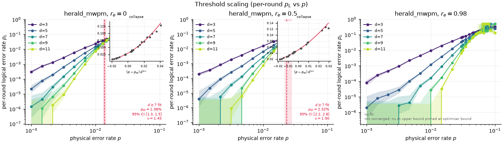
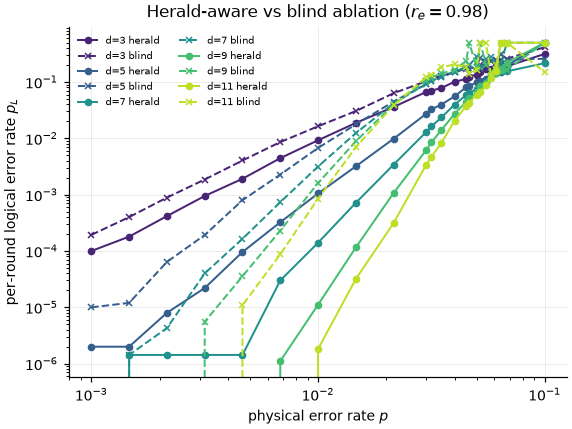
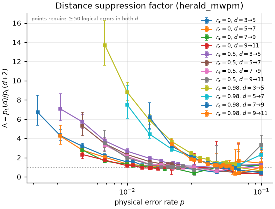

# Herald-Conditioned Decoding of the Erasure-Converted Rotated Surface Code

[](https://github.com/albnewt97/erasure-qec/actions/workflows/ci.yml)

A distance-`d` rotated surface-code memory [[9,10]](#references) with circuit-level noise
[[1]](#references) (Z basis, in [Stim](https://github.com/quantumlib/Stim) [[2]](#references)), under
**erasure conversion**: a fraction
`r_e` of each two-qubit gate's error budget becomes a *heralded erasure* — the hardware flags *which*
qubit was disturbed and *when*. This models **¹⁷¹Yb neutral-atom Rydberg gates** [[3,4]](#references) and
**dual-rail superconducting cavities** [[5,6]](#references). A **herald-conditioned matching decoder**
(PyMatching [[7]](#references), wrapped as a `sinter.Decoder`) zeros the conditioned edge's weight — a
heralded site has conditional error probability ½, so `ln((1−p)/p) = 0` and a correction routes through it
for free.

Everything here is a **Z-basis memory** threshold under a single observable — not a full X+Z circuit-level
threshold (see [Modelling assumptions](#modelling-assumptions)). The detailed statistical methodology,
audit history, and full diagnostics live in [`docs/AUDIT.md`](docs/AUDIT.md); this README states the
results and their caveats in short form.

**Headline (measured).** Holding the *per-gate error budget constant* across `r_e`, the gain from erasure
is almost entirely from **reading the herald bits**, not from the conversion itself:

- **Blind** decoding (discard the herald bits) barely moves the threshold from baseline to `r_e = 0.5`:
  **1.44% → 1.49%** (95% CI `[1.4,1.6]` → `[1.4,2.2]`). That `2.2` upper endpoint is **not an interval
  estimate**: it is set by bound-pinned bootstrap replicates and lands on a discrete atom, `seed = 0`
  is one of only 3 of 30 seeds giving it, and 25 of 30 give `1.8` — see the
  [†footnote](#measured-thresholds-d--7-collapse-fit) on the results table. The point estimates
  (`1.44%`, `1.49%`) carry no RNG and are exact.
- **Herald-conditioned** decoding lifts it: **1.38% → 2.32%** (`[1.3,1.5]` → `[2.2,2.8]`) — a
  **significant** separation (`Δ = blind − herald = −0.83%`, 95% CI `[−1.2,−0.7]`, excludes zero; see
  below). The advantage compounds with distance and erasure fraction (the
  [ablation](#the-herald-aware-vs-blind-ablation)): a measured **41×** at `d = 7` and a **> 103×** lower
  confidence bound at `d = 9`, both at `r_e = 0.98`. The larger `d = 11` bound rests on 3 herald errors and
  is weak evidence — see the [table](#sub-threshold-suppression).

At **`r_e = 0.98`** the collapse fit resolves **neither** threshold and the code says so (`resolved=False`):
the herald fit rails ν to its bound (not converged), and the blind fit converges but its 95% CI runs
from ~1.5% to an upper endpoint that lands anywhere in **5.5–8.5%** depending on the bootstrap seed
(6.3% at `seed = 0`) — 2.4–4.3× wider than the threshold itself, so it is not a resolved value. The
upper endpoint is not a measurement: **three of the ten seeds put it exactly on a sweep grid point**
(`p = 0.055, 0.076, 0.085`), i.e. it is set by bound-pinned replicates rather than by a fitted
crossing — and *both ends of the 5.5–8.5% span are themselves grid pins*, so the width of that span is
a property of the sweep grid, not a spread of fitted values. The near-full-conversion
story therefore leads with the deterministic ablation.
Reproduce every number in this paragraph with
`uv run python scripts/paired_separation.py --full-stability` (~4.7 min).



*Per-round `p_L` vs `p`, one curve per `d ∈ {3,5,7,9,11}`, one panel per `r_e`; dashed line = fitted
`d ≥ 7` threshold with its bootstrap CI. Unresolved fits carry no line ("no fit").*

> **Data status.** Figures are generated from the **committed real Monte-Carlo sweeps** in `data/`
> (`baseline_pauli.csv`, `erasure_r50.csv`, `erasure_r98.csv`). Point estimates, χ²/dof and every
> converged/resolved verdict reproduce **exactly** across NumPy/SciPy versions; bootstrap CI endpoints
> do **not** — they drift with the NumPy RNG, and `sinter.collect` takes no seed so the sweeps
> themselves cannot be regenerated shot-for-shot. See
> [`docs/AUDIT.md`](docs/AUDIT.md#reproducibility-and-environment-sensitivity-2026-09-06).
> Pinned regression snapshots live at `tests/fixtures/real_*.csv`. Committed **synthetic fixtures**
> (`tests/fixtures/synthetic_*.csv`) drive the byte-stable plotting/analysis tests and are **not
> measurements** — they are generated from the same collapse variable the fitter inverts (one is
> deliberately adversarial and the fitter must *reject* it). Stale pre-fix sweeps are preserved untracked
> under `data/stale_old_model/`.

---

## Measured thresholds (`d ≥ 7` collapse fit)

95% bootstrap percentile CI, `n_boot = 1000`, `seed = 0`, endpoints to **one decimal** — the second
decimal moves with the seed and with the NumPy build (see
[`docs/AUDIT.md`](docs/AUDIT.md#reproducibility-and-environment-sensitivity-2026-09-06)). `p_th`, ν and
χ²/dof carry no RNG and are exact. A fit is only quoted as a threshold when the code marks it
`resolved` (converged **and** CI narrower than `p_th`).

| `r_e` | herald `p_th` [95% CI] | blind `p_th` [95% CI] | χ²/dof (h/b) | note |
|---|---|---|---|---|
| 0.0 | **1.38%** `[1.3,1.5]` (ν=1.45) | **1.44%** `[1.4,1.6]` (ν=2.12) | 1.02 / 1.15 | control: no heralds → decoders agree within CIs |
| 0.5 | **2.32%** `[2.2,2.8]` (ν=1.90) | **1.49%** `[1.4,2.2]`† (ν=1.58) | 0.62 / 0.47 | herald above blind — separation **significant**, see Δ |
| 0.98 | **not resolved** (ν-pinned) | **not resolved** (CI `[1.5, 5.5–8.5]`, upper endpoint seed-dependent and grid-pinned — see above) | — / 0.20 | fit resolves neither; use the ablation |

† **The `r_e = 0.5` blind upper endpoint is not a fitted crossing, and `2.2` is an unlucky
seed.** It is a *bound pin*: on ~7.5% of bootstrap replicates the resampled blind crossing
estimate runs into the saturated tail, the fit window's **lower** edge lands on a high grid
point, and `curve_fit` pins `p_th` there. Those pins form discrete atoms, and the 97.5th
percentile falls inside one. Over 30 seeds the endpoint takes **four distinct values**, and
**25 of 30 seeds give 1.80%** — `seed = 0`, which this table quotes, is one of only **3 of 30**
that give 2.154%. Excluding edge-pinned replicates moves it from 2.154% to 1.601%. So the
modal interval at this precision is `[1.4, 1.8]`, not `[1.4, 2.2]`; the published cell is the
**wider, conservative** end of a quantised endpoint, not a threshold the fit supports at 2.2%.
The `p_th` point estimate (1.49%), ν and χ²/dof are unaffected — they carry no RNG — and no
verdict changes (`converged` and `resolved` are True for all 30 seeds). Reproduce with
`uv run python scripts/paired_separation.py --full-stability`; the 30-seed enumeration is in
[`docs/AUDIT.md`](docs/AUDIT.md#the-marginal-ci-upper-endpoints-are-bound-pins-2026-09-06).

**Is the `r_e = 0.5` separation significant? Yes — and comparing the marginal CIs above is not how you
test it** (`var(Δ)` is not the sum of the marginal variances). The valid test is a bootstrap of the
difference `Δ = p_th(blind) − p_th(herald)`: **Δ = −0.83%, 95% CI `[−1.2, −0.7]`, excludes zero**, stable
across seeds (all of seeds 0–9 exclude zero —
`uv run python scripts/paired_separation.py --full-stability`) (control `r_e = 0` gives Δ consistent with zero). Two caveats, both worked out in full in
[`docs/AUDIT.md`](docs/AUDIT.md#paired-decoder-separation-phase-4): (i) the sweeps are sampled
*independently* per decoder, so this is an *unpaired* difference bootstrap — which can only be wider than a
paired one, making the result **conservative**; (ii) the CI conditions on both decoders converging, and
the ~10% discards are **not missing-at-random** (they cluster at high blind `p_th`), but a tipping-point
bound shows the claim survives — the upper endpoint reaches zero only if ≥ 24 of the 102 discards had
`Δ ≥ 0` (seed 0; 24–26 of 77–115 across seeds 0–9, from
`uv run python scripts/paired_separation.py --full-stability`), while their recorded `p_th` imply `Δ ≥ 0` for only 2. So: significant *conditional on
convergence*. The [ablation](#the-herald-aware-vs-blind-ablation), which needs no fit, is the primary
evidence.

### Comparison to the literature

Wu et al. [[3]](#references) report thresholds rising **0.937% → 4.15%** at 98% conversion. **Our numbers
are not on a comparable footing with theirs.** The comparison below is *structural only* — both show the
threshold rising with the converted fraction — and no numerical agreement is claimed at any `r_e`,
including `r_e = 0`. We also do not claim a matching 98% number: our `d ≥ 7` herald fit does not resolve at
`r_e = 0.98`.

The one axis that *does* line up is the conversion fraction. Their `R_e` is defined per two-qubit gate
exactly as our `r_e` is: "each two-qubit gate experiences either a Pauli error with probability
`p_p = p(1 − R_e)`, or an erasure with probability `p_e = pR_e`" (§III). Everything else differs:

- **Code.** They simulate the **planar XZZX** surface code (§III, after Bonilla Ataides et
  al. [[12]](#references)); we
  simulate the rotated surface code. They state it "performs identically to the standard surface code for
  the case of unbiased noise", and our `HERALDED_ERASE` is unbiased — so this is a caveat rather than a
  fatal mismatch, and their patch is a `d × d` data-qubit array, the same count as our rotated patch.
- **Decoder.** They use a **weighted Union-Find** decoder and note that "the UF decoder is optimal for pure
  erasure errors" (Delfosse & Zémor, PRR **2**, 033042). We use **MWPM with the heralded edges' weight set
  to 0**, which is *not* ML-optimal for erasure. This gap **grows with `r_e`**: it is smallest at our
  baseline and largest exactly where our high-`r_e` story lives, so our `r_e = 0.98` ablation should be
  read as a lower bound on what an ML erasure decoder would show. See
  [`docs/FUTURE_WORK.md`](docs/FUTURE_WORK.md).
- **Observable.** Ours is a **Z-basis memory scored on a single logical observable** (one
  `OBSERVABLE_INCLUDE` over `logical_z_support(d)`; only Z-type detectors close at the time boundaries).
  Theirs is "the logical failure rate" from decoding the full syndrome — they never restrict to one
  observable or one basis. A single-observable Z-memory cannot fail in ways a full-code failure metric
  counts, so **ours is the more permissive metric**.
- **What else is noisy.** Their Figs. 3–4 set `p_m = 0` and "neglect idle errors", so two-qubit gates are
  their only error locations and `R_e` is *also* their circuit-wide erasure fraction. We add unheralded
  measurement, reset and idle noise at rate `p`, none of which is ever converted — so our `r_e` is **not**
  our circuit-wide fraction: at `r_e = 0.98` only ~45% of our DEM error mass is heralded (below). The two
  `0.98` columns therefore describe different circuits, and we read the shortfall in neither direction.
- **Finite-size window.** Their thresholds come "from the crossing of `d = 11` and `d = 15`"; ours from a
  `d ≥ 7` collapse fit over `d ∈ {7, 9, 11}`.

**An unexplained sign problem.** At `r_e = 0` we carry **strictly more** noise than Wu et al. — a
`d = 5, T = 5, p = 0.01` circuit emits 400 `DEPOLARIZE2(p)` two-qubit-gate locations (the same budget as
theirs) *plus* 470 locations they do not have: 180 `DEPOLARIZE1(p)` idle and 290 `X_ERROR(p)`
measure/reset. More noise should push the threshold **down**, yet we report **1.38% against their
0.937%**. We do not know why, and we do not read this gap as agreement.

The leading candidate is the **observable** difference above: a single-observable Z-memory is a strictly
more permissive failure criterion than a full-code logical failure rate. **We have not demonstrated this**
— the repo has no X-memory or two-observable circuit to test it against — so it stays an **open item, not
a conclusion**. The **finite-size window** is a second contributor, and it is measurable: refitting the
committed baseline sweep at rising `d_min` moves the herald threshold monotonically *down* —
**1.708%** (all `d`) → **1.509%** (`d ≥ 5`) → **1.376%** (`d ≥ 7`) → **1.300%** (`d ≥ 9`, unconverged, two
distances) — and it has not flattened at the top of our range, so a `d = 11`/`d = 15` crossing would sit
lower still. That plausibly accounts for part of the 0.44-point gap, not obviously all of it. Neither
paper has the noise-matched run that would settle it: their SI reports `p_m = p` only at `R_e = 0.98`
(threshold falls 4.15% → 2.85(1)%), with no `R_e = 0` counterpart. Fit-window mechanics in
[`docs/AUDIT.md`](docs/AUDIT.md#threshold-fitting-methodology-reference).

### Where the gain comes from

With the budget held constant, the split is the *opposite* of an "erasure is intrinsically cheaper"
intuition. **Erasure conversion alone** (blind) moves the threshold `1.44% → 1.49%` from `r_e = 0` to
`0.5` — close to a wash. **Herald-conditioned decoding** is where the benefit lives: `1.38% → 2.32%`, and
the growing sub-threshold suppression below. We make **no causal claim** about *why* blind barely helps
(both channels are Pauli; "depolarizing is cheaper to correct" would be hand-waving) — the old
`1.6×`-blind / `2.7×`-herald decomposition was an artifact of the pre-fix budget-shrinking model and does
not survive (re-derivation in [`docs/AUDIT.md`](docs/AUDIT.md)).

---

## Noise channels (§5)

The erasure model follows Wu et al. [[3]](#references). `HERALDED_ERASE` is **unbiased** — `I/2`, all four
Paulis equal (the advantage is from decoding, not Pauli bias). Per two-qubit gate on `(a, b)`:

| Channel | Rate | Where |
|---|---|---|
| `DEPOLARIZE2` | `p·(1 − r_e)` | on `(a, b)` — residual Pauli |
| `HERALDED_ERASE` | `(2/3)·p·r_e` | on `a`, and independently on `b` — appends a herald bit |
| `X_ERROR` / `X_ERROR` / `DEPOLARIZE1` | `p_meas` / `p_reset` / `p_idle` (`= p`) | before `M`/`MR`, after `R`, on idle qubits |

The `(2/3)·p·r_e` rate (an erasure is non-identity only ¾ of the time, so `2·q·¾ = p·r_e`) holds the
per-gate non-identity budget at `p` for **every** `r_e` (tested by `test_error_budget_invariance`), so
`r_e` *converts* the budget rather than shrinking it and `p` is itself the iso-noise axis. Detector algebra
is standard; the one non-standard convention here is that **herald detectors carry a 4th sentinel
coordinate `(x, y, t, 1)`** the DEM partition splits on ([PLAN.md](PLAN.md) §3.4). Per-round conversion, the finite-size ansatz
[[11]](#references), and the bootstrap/guard details are in
[`docs/AUDIT.md`](docs/AUDIT.md#threshold-fitting-methodology-reference).

> **`r_e` is the 2q-gate fraction, not the circuit-wide heralded fraction.** Meas/reset are never
> converted (idle only if `convert_idle`), so the fraction of *total DEM error mass* heralded is well below
> `r_e`. Wu et al.'s `R_e` is on the *same* per-2q-gate axis as `r_e`, but because they set
> `p_m = p_idle = 0` their `R_e` is simultaneously their circuit-wide fraction, whereas ours is not.
> Measured by
> `scripts/heralded_fraction.py` at `d = 5, p = 0.02`: gate-only **0.23 / 0.45** at `r_e = 0.5 / 0.98`
> (0.32 / 0.63 with `convert_idle`). The committed sweeps use gate-only, so `r_e = 0.98` heralds **45%** of
> the mass, not 98%. These exclude the no-op herald branches: `HERALDED_ERASE` heralds on its identity
> branch too, so the DEM carries mechanisms that flip a herald detector and nothing else, and a branch
> that causes no syndrome and no logical error is not part of the error budget. Counting them (the
> pre-2026-09-05 definition, still available as `count_no_op_heralds=True`) gave 0.30 / 0.55 and
> 0.42 / 0.72 — i.e. it overstated conversion.

---

## The herald-aware vs. blind ablation



Same shots, two decoders: `herald_mwpm` reads the herald bits and zeroes the conditioned edges;
`blind_mwpm` strips the herald columns and folds erasures into static depolarizing noise. This is
decoder-vs-decoder **on identical shots** — independent of noise normalisation, needs no fit — the most
robust result here. **The ablation is paired by construction** (`scripts/ablation_table.py` samples once
and decodes the same `dets` with both decoders); the sinter *threshold sweeps* are not (sampled per
decoder), which is why the Δ test above uses an unpaired bootstrap while the ablation needs none.

**Forced-erasure correctness (M6 test).** Shots are sampled with probability-1 probe erasures on
`(1,3)`/`(1,5)` (`probe_q = 1.0`), but **both decoders are compiled from a circuit with
`probe_q = 0.02`** — a deliberate mis-specification, and load-bearing: it is what makes blind price
those two locations at a small unconditional marginal, as a decoder that does not know the erasures
occurred would. (It costs the herald-aware decoder nothing, since the herald bits zero those edges
per shot regardless of the compiled weight.) A double-X event then produces a syndrome (single
detector `D(2,2,1)`) indistinguishable from a single X on `(1,1)` (on the logical support). Blind
takes the cheaper one-edge route and **flips the logical**; herald-aware sees both erased edges at
weight 0 and does not. Blind fails on the ~1/4 of shots where both probes take an X-like Pauli — the
test asserts 15–35% of 2048 shots — while herald fails 0. No exact count is quoted: stim's seeded
sampling is reproducible only on the same machine and stim version, so the draw moves between
environments.

### Sub-threshold suppression

`p_L(blind) / p_L(herald)` at fixed sub-threshold `p = 1.0%`, by distance (`scripts/ablation_table.py`,
100 000 shots, seed 0; ~46 min on one core). One statistical standard across the repo: cells below the
**≥ 50 observed-error gate** the Λ figure uses are reported as a lower confidence bound `> N×`, not a point
ratio.

| `d` | `r_e = 0.5` | `r_e = 0.98` |
|---|---|---|
| 3 | 1.3× | 2.1× |
| 5 | 1.9× | 8.8× |
| 7 | 2.8× | 41.2× |
| 9 | 4.1× | **> 103×** † |
| 11 | 6.4× | **> 339×** †‡ |

*† Below the 50-error gate (herald errors: `d = 9` → 23, `d = 11` → 3 of 100 000 shots at `r_e = 0.98`), so
what is quoted is a **lower confidence bound**, not a point value. It is blind's Wilson **lower** limit
divided by herald's Wilson **upper** limit, both mapped through the per-round conversion. Each is an
endpoint of a two-sided 95% Wilson interval — a one-sided 97.5% limit — so Bonferroni makes the quoted
value a **≥ 95% one-sided lower bound on that cell's ratio**. It is per-cell, **not** simultaneous across
the table, and not paired: it ignores the positive correlation from decoding identical shots, which only
makes it looser. (Before 2026-09-05 this column divided blind's *point estimate* by herald's Wilson upper
limit, which bounded nothing; the corrected values are ~3% lower.)*

*‡ **The `d = 11` cell rests on 3 herald errors in 100 000 shots — treat `> 339×` as weak evidence, not a
measurement.** At single-digit counts Wilson's "95%" is a nominal approximation with no guaranteed actual
coverage, and the herald shot-rate CI there spans `[1.0e-5, 8.8e-5]`, nearly an order of magnitude. The
honest reading is "herald errors were too rare to measure at `d = 11`", not "suppression is 339×". The
point ratio at that cell is 1034×, which is precisely why no point ratio is quoted. The `d = 9` cell (23
errors) is also below the gate but far less fragile.*

The advantage clearly compounds with both distance and erasure fraction over the range where the counts
support it — every `r_e = 0.5` cell and the `r_e = 0.98` cells up to `d = 7` clear the 50-error gate. How
far that compounding continues at `d = 9` and `d = 11` is bounded from below by this run but not measured
by it; settling it needs more shots, not more distance.

---

## Distance suppression (Λ factor)



`Λ = p_L(d) / p_L(d+2)` at fixed `p`, with bootstrap CIs; `Λ > 1` below threshold means distance helps
(the exponential below-threshold suppression reviewed in Fowler et al. [[13]](#references)), and
larger `r_e` gives larger `Λ`. The `Λ` *notation* is not from that paper; the anchor is for the
suppression statement only. Points are shown only where **both** distances have ≥ 50 observed errors;
the low-statistics tail is dropped.

The suppression table uses the **same constant, not the same rule**. `figure_lambda` requires ≥ 50
errors at *both* `d` and `d+2`; `ablation_table._fmt_ratio` gates on the **herald** count alone,
because herald is the fragile denominator there. Each applies the ≥ 50 threshold to whichever count
can go small in that particular statistic. On the committed sweeps the two coincide — blind counts run
3016–6290, far above 50, so gating on herald alone excludes nothing the joint rule would have kept —
but they are not the same predicate and would diverge on data where blind is the sparse side.
(Blind-count range from the raw-count table recorded in
[`docs/AUDIT.md`](docs/AUDIT.md) on 2026-09-05, not re-measured here — the sweep is ~46 min.)

---

## Modelling assumptions

This is an idealized erasure model. Each assumption below is **systematically optimistic** — a real device
is worse in each respect — so the thresholds and suppression ratios here are upper bounds on what this
scheme delivers in hardware, not predictions of it.

- **Erasure is injected *after* the CX, independently per qubit.** There is no mid-gate erasure that
  propagates through the remainder of the gate, and no correlated two-qubit erasure — the two qubits of a
  gate erase independently. Real leakage happens *during* the gate and can corrupt both qubits together.
- **The erased qubit keeps participating perfectly in all later rounds.** `HERALDED_ERASE` replaces the
  qubit with `I/2` for that instant only; it is a fully-functional qubit again on the next tick. A real
  ¹⁷¹Yb erasure is an atom *leaked out of the qubit subspace* — it stays broken until physically
  re-prepared, so a single erasure should degrade many subsequent rounds, which we do not model.
- **Heralds are perfect.** Instantaneous, 100% reliable, zero false positives, zero latency. Real
  fluorescence heralding has finite fidelity, false positives/negatives, and a latency the decoder would
  have to tolerate.
- **The erasure is unbiased.** `HERALDED_ERASE` is `I/2` (all four Paulis equal). The Z-biased leakage of
  Sahay et al. [[8]](#references) would give a *further* threshold advantage that we deliberately do not
  model; our advantage is from herald-conditioned decoding alone.
- **Z-memory only, single logical observable.** Every "threshold" here is the **Z-basis memory** threshold
  under a single observable — not a full X+Z circuit-level threshold, and not a logical-gate or computation
  threshold. Read every number in this repo with the "Z-memory" qualifier attached.

---

## Caveats and limitations

- **Neither `r_e = 0.98` threshold is measured.** The large codes saturate to ½ within one grid step above
  the ~6% crossing, so the herald fit rails ν to its bound and the blind fit's CI is wider than its own
  `p_th`; both are `resolved=False` in code. Resolving them needs a denser, higher-statistics `p`-grid
  (future work). The ablation is the robust high-`r_e` result.
- **The effective crossing drifts with distance** (+0.33% at `r_e = 0`, larger at higher `r_e`), so every
  threshold uses the asymptotic `d ≥ 7` fit, which drops `d ∈ {3,5}`.
- **ν is only weakly constrained at `d ≤ 11`** (three large distances, coarse grid); `p_th` is far better
  determined than `ν`, and the fit reports χ²/dof so this is visible.
- **`estimate_crossing` is unreliable on saturated data**; it only seeds the fit window, and every quoted
  threshold comes from the `d ≥ 7` collapse fit, never the raw crossing estimate (mechanism in
  [`docs/AUDIT.md`](docs/AUDIT.md#threshold-fitting-methodology-reference)).

---

## Other components

- **Hook regression** (`figures/hook_regression.png`, §3.2). `shortest_graphlike_error()` vs `d` from the
  builder (no Monte Carlo): the hook-safe CX schedule keeps graphlike distance tracking `d`, a deliberately
  broken one halves it to `⌈(d+1)/2⌉` — the regression test that the scheduling logic matters.
- **DEM hand-verification.** The DEM partition was verified by hand on the `d=3, T=2` instance and
  reconciled against Stim (incl. a non-obvious two-erasure/one-detector cancellation):
  [`docs/dem_worksheet.md`](docs/dem_worksheet.md).
- **Decoder throughput** (two-tier dispatch): herald-free shots batch on the base matcher; heralded
  shots group by fired-herald signature, one vectorized matcher built per signature. Measured on an
  **Apple M2 (8 cores, macOS 14.5), single-threaded, otherwise idle**, `d=5, p=3e-2`, 10⁴ shots:
  a **median 79.8k shots/s** herald-free vs a **median 1,578 shots/s** at `r_e = 0.98` — a **median
  50.8× gap**. Over 10 consecutive runs (2026-09-06) the *observed* spreads were 77.3k–85.7k, 1,529–1,585
  and 48.8–54.4× respectively (sd 2.5k, 17, 1.6). **Those spreads are what 10 runs happened to produce,
  not a predictive interval** — an 11th run may fall outside them, and the previously published min–max
  (77.4k–84.2k, 1,542–1,593) was breached at both ends by this very sample. Quote the median; treat the
  range as a scatter estimate. Reproduce with
  `uv run pytest tests/test_end_to_end_montecarlo.py -k throughput -s`.
  Both the rates *and the gap* are hardware- and load-dependent — on this same machine under full CPU
  oversubscription the gap ranged 55.8–65.3× — so treat the ~51× as one machine's number, not a
  property of the decoder. Replacing the per-shot matcher rebuild with per-signature vectorized
  construction narrowed the gap from ~69× to ~51×; it did **not** bring it under the 50× target that
  motivated the work. (An earlier revision of this bullet claimed 48×; that was 80,000/1,650, a ratio
  of two independently rounded numbers rather than a measured one.)

---

## Architecture

```
src/erasure_qec/
├── config.py              # frozen NoiseParams / ExperimentConfig (+ YAML I/O)
├── circuits/              # layout.py (pure geometry), scheduling.py (CX schedules), builder.py (emits stim)
├── noise/                 # model.py (NoiseParams -> channel rates), injector.py (Null/PauliOnly/Erasure)
├── decoding/              # dem_partition.py [§6], herald_matching.py [§8], sinter_adapter.py [§9]
└── analysis/              # statistics.py, threshold_fit.py, synthetic.py, dem_stats.py, plotting.py [§10]
experiments/               # collect_threshold_sweep.py, collect_lambda_scan.py, make_synthetic_fixtures.py, configs/
scripts/                   # analyses: audit_checks.py, ablation_table.py, heralded_fraction.py, paired_separation.py
                           # dev probes: partition_check.py, worksheet_probe.py
```

Built milestone-by-milestone (M0–M9); see [PLAN.md](PLAN.md) for the full spec and
[`docs/AUDIT.md`](docs/AUDIT.md) for the audit that drove the noise-model and threshold-fit corrections.

---

## Reproducing

```bash
uv sync --group dev
uv run pytest -q                  # full suite (a few slow Monte-Carlo tests)
uv run pytest -m "not slow" -q    # fast lane

# regenerate every figure from the committed sweeps
# (byte-identical to the committed PNGs *within one environment* -- see note below):
uv run python -m erasure_qec.analysis.plotting --data-dir data --figures-dir figures

# reproduce the analyses (wall-clock measured single-core on an Apple M2, 2026-09-06):
uv run python scripts/heralded_fraction.py   # circuit-wide heralded fraction vs r_e            (~2 s)
uv run python scripts/paired_separation.py   # Delta significance + discard diagnostics         (~72 s)
uv run python scripts/paired_separation.py --full-stability   # + the 10-seed stability table    (~4.7 min)
uv run python scripts/audit_checks.py        # docs/AUDIT.md table (pre-fix expectations vs HEAD) (~2 min)
uv run python scripts/ablation_table.py      # sub-threshold suppression, direct from circuits  (~46 min)
```

**On "byte-stable".** `tests/test_plotting.py::test_figures_regenerate_byte_stable`
pins *run-to-run* determinism: the same CSVs rendered twice in the same environment give
byte-identical PNGs. That is **not** a cross-environment guarantee. PNG bytes depend on the
matplotlib/FreeType build, and `lambda_vs_p.png` draws bootstrap CI bars, which drift with
the NumPy RNG exactly as the threshold CIs do. Verified 2026-09-06 to regenerate
byte-identical to the committed PNGs (all four, incl. `lambda_vs_p.png` md5 `442e7f13…`)
on **macOS 14.5 arm64, Python 3.14.6, NumPy 2.5.1, SciPy 1.18.0, stim 1.16.0,
pymatching 2.4.0, sinter 1.16.0** — matching "env B" of the
[`docs/AUDIT.md`](docs/AUDIT.md#reproducibility-and-environment-sensitivity-2026-09-06)
reproducibility table on every version that table records, plus **matplotlib 3.11.0**,
which that table does not record and which is the dependency PNG bytes are most sensitive
to. On a different matplotlib or NumPy, expect the figures to be visually identical but
not byte-identical.

`ablation_table.py` is the slow one: it decodes 100k shots per cell over `d = 3..11` x `r_e = 0.5, 0.98`
with no CSV shortcut, and `d = 9`/`d = 11` dominate. `--shots` trades runtime for the >= 50-error gate.

Re-collecting the real sweeps is resumable (remove `data/<name>.csv` first to start clean); rough
wall-clock on 8 cores is ~10–20 min (`baseline_pauli`), ~1–2 h (`erasure_r50`), ~4–8 h (`erasure_r98`,
slow-path dominated). Regenerate synthetic fixtures with
`uv run python experiments/make_synthetic_fixtures.py`.

## References

Future directions (imperfect/delayed heralds, other hardware, logical algorithms, alternative decoders,
and a denser high-`r_e` sweep to resolve the `r_e = 0.98` herald threshold) are in
[`docs/FUTURE_WORK.md`](docs/FUTURE_WORK.md).

1. Tomita & Svore, *Low-distance surface codes under realistic quantum noise*, Phys. Rev. A **90**,
   062320 (2014), [arXiv:1404.3747](https://arxiv.org/abs/1404.3747)
2. Gidney, *Stim: a fast stabilizer circuit simulator*, Quantum **5**, 497 (2021),
   [arXiv:2103.02202](https://arxiv.org/abs/2103.02202)
3. Wu, Kolkowitz, Puri & Thompson, *Erasure conversion for fault-tolerant quantum computing in
   alkaline earth Rydberg atom arrays*, Nat. Commun. **13**, 4657 (2022),
   [arXiv:2201.03540](https://arxiv.org/abs/2201.03540)
4. Ma et al., *High-fidelity gates and mid-circuit erasure conversion in an atomic qubit*,
   Nature **622**, 279 (2023)
5. Kubica et al., *Erasure Qubits: Overcoming the T₁ Limit in Superconducting Circuits*,
   Phys. Rev. X **13**, 041022 (2023), [arXiv:2208.05461](https://arxiv.org/abs/2208.05461)
6. Teoh et al., *Dual-rail encoding with superconducting cavities*, PNAS **120**, e2221736120 (2023),
   [arXiv:2212.12077](https://arxiv.org/abs/2212.12077)
7. Higgott & Gidney, *Sparse Blossom: correcting a million errors per core second with
   minimum-weight matching*, Quantum **9**, 1600 (2025),
   [arXiv:2303.15933](https://arxiv.org/abs/2303.15933)
8. Sahay, Jin, Claes, Thompson & Puri, *High-Threshold Codes for Neutral-Atom Qubits with Biased Erasure
   Errors*, Phys. Rev. X **13**, 041013 (2023),
   [arXiv:2302.03063](https://arxiv.org/abs/2302.03063)
9. Dennis, Kitaev, Landahl & Preskill, *Topological quantum memory*, J. Math. Phys. **43**, 4452
   (2002), [arXiv:quant-ph/0110143](https://arxiv.org/abs/quant-ph/0110143)
10. Bombin & Martin-Delgado, *Optimal resources for topological two-dimensional stabilizer codes:
    comparative study*, Phys. Rev. A **76**, 012305 (2007) — the rotated surface-code layout,
    [arXiv:quant-ph/0703272](https://arxiv.org/abs/quant-ph/0703272)
11. Wang, Harrington & Preskill, *Confinement-Higgs transition in a disordered gauge theory and the
    accuracy threshold for quantum memory*, Ann. Phys. **303**, 31 (2003),
    [arXiv:quant-ph/0207088](https://arxiv.org/abs/quant-ph/0207088)
12. Bonilla Ataides, Tuckett, Bartlett, Flammia & Brown, *The XZZX surface code*, Nat. Commun. **12**,
    2172 (2021), [arXiv:2009.07851](https://arxiv.org/abs/2009.07851)
13. Fowler, Mariantoni, Martinis & Cleland, *Surface codes: Towards practical large-scale quantum
    computation*, Phys. Rev. A **86**, 032324 (2012),
    [arXiv:1208.0928](https://arxiv.org/abs/1208.0928)

## License

MIT — see [LICENSE](LICENSE).
