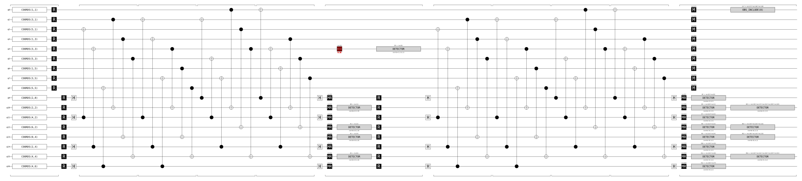
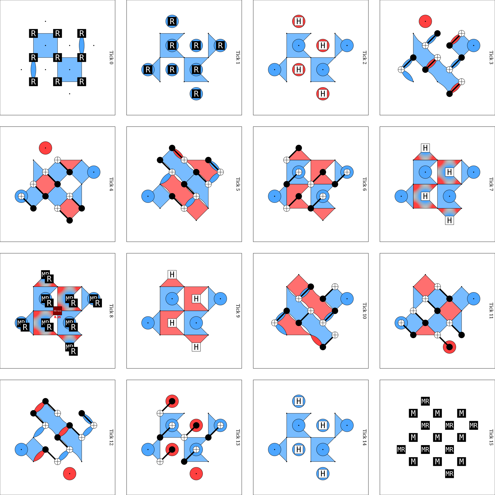
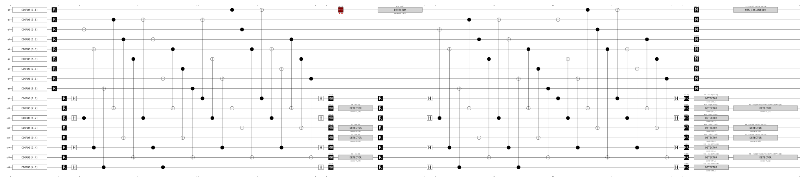
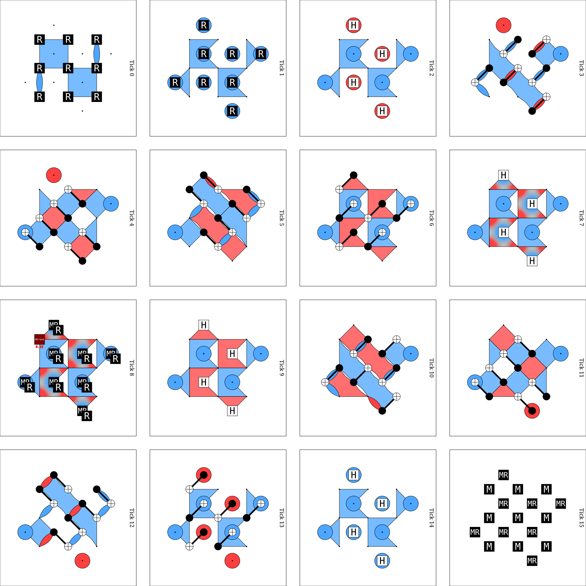
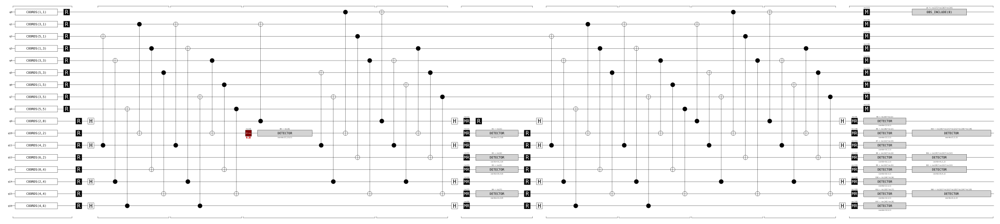

# DEM Hand-Verification Worksheet — Complete Beginner's Guide

> **What this document is.** A fully worked, step-by-step guide for milestone M5's
> hand-verification (PLAN.md §7). You will predict, on paper, exactly what Stim's
> Detector Error Model (DEM) must contain for three tiny probe circuits, then run
> Stim, reconcile every line, and turn the reconciled results into
> `tests/test_dem_partition.py`.
>
> **Who it's for.** Someone comfortable with Python and basic quantum computing
> (qubits, Pauli X/Y/Z, CNOT) but new to surface codes, Stim, and matching decoders.
> Every concept used is explained before it's used.
>
> **The golden rule.** Predict FIRST, print SECOND. If you look at Stim's output
> before writing your prediction, you will unconsciously rationalize whatever you
> see, and the exercise proves nothing. Physically cover the terminal output until
> your paper table is complete.

---

## ★ PROJECT STATUS (updated 2026-07-08 from live runs)

**Verified facts for THIS repository — use these, not generic placeholders:**

| Fact | Value |
|---|---|
| Parity convention | **MIRRORED** vs. this guide's first draft: interior Z-checks at **(2,2), (4,4)**; interior X-checks at (2,4), (4,2). Boundary: Z-type at (0,4), (6,2); X-type at (2,0), (4,6). All tables below have been rewritten for this. |
| `logical_z_support(3)` | **[(1,1), (3,1), (5,1)]** — the y=1 row. So (3,3) ∉ support → Probe A has **no L0 anywhere**; (1,1) ∈ support → Probe B has **L0 on the X and Y lines**. |
| Probe q | 0.25 (builder default `probe_q`) → every DEM line = q/4 = **0.0625** |
| Detector layout (Probes A/B) | Herald is **D4** (emitted after round-0 detectors); D0–D3 = round-0 Z (t=0); D5–D12 = round-1 (t=1); D13–D16 = closing (t=2) |
| Herald time coordinate | Stamped with the emitting round (Probe A/B: `[x, y, 0, 1]`). Identify heralds ONLY by 4th coordinate = 1, never by t. |
| Mid-round probe indexing | `mid_round_probe_erasures=(qubit, round, after_cx_layer)`, **0-indexed layers**: value **1** = between CX layers 2 and 3 |
| DEM printing | Script prints with `decompose_errors=True` (shows `^` separators) — see updated note in §0.4 |

**Progress:** ✅ Setup · ✅ Probe A reconciled + partition verified (Design 2)
· ✅ Probe B reconciled + partition verified (boundary edges + L0 mask) ·
✅ Probe C DEM reconciled (2026-07-09) · ⬜ Probe C partition check (freeze
`expected_edges = [((5,), ()), ((6, 13), ())]` into `partition_check.py C`
and run) · ⬜ Freeze tests + close M5 (Part 6, Session 4)

**→ Your immediate next step:** Part 6, Session 3 item 18, then Session 4.

---

## Part 0 — Background Concepts (read once, refer back as needed)

### 0.1 The rotated surface code in 60 seconds

A distance-3 rotated surface code stores one logical qubit in 9 **data qubits**
arranged in a 3×3 grid. Interleaved between them are 8 **ancilla qubits**, each
responsible for repeatedly measuring one **stabilizer** — a parity check on the
2 or 4 data qubits around it.

- A **Z-stabilizer** measures the product Z⊗Z⊗Z⊗Z of its data neighbors.
  It detects **X errors** on those neighbors (X anticommutes with Z).
- An **X-stabilizer** measures X⊗X⊗X⊗X. It detects **Z errors**.

In our coordinate system (matching Stim's generator and `layout.py`):

- Data qubits sit at odd-odd coordinates: (1,1), (1,3), (1,5), (3,1), (3,3),
  (3,5), (5,1), (5,3), (5,5). That's d² = 9.
- Ancillas sit at even coordinates (plaquette centers and boundary bumps).
  That's d²−1 = 8: four interior weight-4 checks at (2,2), (2,4), (4,2), (4,4),
  and four weight-2 boundary checks.

**✅ Parity convention — VERIFIED against `ancilla_coords(3)` on 2026-07-08.**
This repository's checkerboard assignment is:

| Ancilla | Type | Weight | Notes |
|---|---|---|---|
| (2,2) | **Z** | 4 | interior; neighbors (1,1), (3,1), (1,3), (3,3) |
| (4,4) | **Z** | 4 | interior; neighbors (3,3), (5,3), (3,5), (5,5) |
| (2,4) | **X** | 4 | interior; neighbors (1,3), (3,3), (1,5), (3,5) |
| (4,2) | **X** | 4 | interior; neighbors (3,1), (5,1), (3,3), (5,3) |
| (0,4) | **Z** | 2 | left-edge boundary check |
| (6,2) | **Z** | 2 | right-edge boundary check |
| (2,0) | **X** | 2 | top-edge boundary check |
| (4,6) | **X** | 2 | bottom-edge boundary check |

Consistency checks that passed: 4 Z + 4 X = 8; Z-type boundary checks on
left/right edges and X-type on top/bottom, per PLAN.md §2; and the four
round-0 (t=0) detectors from the live run sit exactly on the four Z-ancillas —
so the builder and the layout agree about parity. All prediction tables in
this guide use this convention.

### 0.2 What a measurement outcome is, and why it's random-but-correlated

Each round, every ancilla is measured and yields a bit. Call the outcome of
ancilla *a* in round *t*: **s_a(t)**. Individual outcomes can be random (the code
state is a superposition), but in a noiseless circuit certain **parities** of
outcomes are deterministic:

- Measuring the same stabilizer twice in a row gives the same answer:
  s_a(t) ⊕ s_a(t−1) = 0 always, absent errors.
- Data qubits start in |0⟩, which is a +1 eigenstate of every Z-stabilizer, so
  the very first Z-stabilizer measurement is deterministically 0: s_a(0) = 0.
  (X-stabilizer outcomes in round 0 ARE random — |0…0⟩ is not an X eigenstate —
  which is why round 0 has Z-only detectors.)
- After the final transversal Z-basis measurement of all data qubits (outcomes
  m_q), you can recompute each Z-stabilizer offline as ⊕_{q∈∂a} m_q, and it must
  agree with the last ancilla reading: (⊕ m_q) ⊕ s_a(T−1) = 0.

### 0.3 What a DETECTOR is

A **detector** is exactly one of those deterministic parities, declared in the
circuit. When noise flips it, we say the detector "fires." For our d=3, T=2
probe circuit the full inventory is:

| Detector group | Formula | Count | Time coord |
|---|---|---|---|
| Round-0 Z checks | D = s_a(0) | 4 | t = 0 |
| Round-1 bulk (all 8 ancillas) | D = s_a(1) ⊕ s_a(0) | 8 | t = 1 |
| Closing Z checks | D = (⊕_{q∈∂a} m_q) ⊕ s_a(1) | 4 | t = 2 |

Total: **16 syndrome detectors**. The probe adds **1 herald detector** (see 0.5),
so `circuit.num_detectors` must print **17**. If it doesn't, stop — your builder
or probe hook is wrong, and nothing downstream is trustworthy.

Notation used below: **D(x, y, t)** means "the detector whose declared
coordinates are (x, y, t)" — e.g. D(2,4,1) is the round-1 comparison detector of
the Z-ancilla at (2,4).

### 0.4 What the Detector Error Model (DEM) is

`circuit.detector_error_model()` asks Stim to enumerate every independent noise
mechanism in the circuit and report, for each one:

```
error(p)  D_i  D_j  ...  [L0]
```

meaning: "with probability p, this mechanism fires detectors D_i, D_j, … and
(if L0 is present) flips logical observable 0." The DEM is the decoder's entire
view of the world. If the DEM is right, decoding is a solved problem; if it's
wrong, everything downstream is garbage. That's why we verify it by hand.

Two flags matter:

- `flatten_loops=True`: expands repeat blocks so detector indices are plain
  integers you can match against `get_detector_coordinates()`. **Always** use
  this for hand verification.
- `decompose_errors=True`: asks Stim to suggest how to split multi-detector
  mechanisms into graph-like pieces, shown with `^` separators. **The live run
  used this flag and it worked fine** — Stim isolated the herald as its own
  component (`... ^ D4`) and split the Y mechanism into its two natural pairs
  (`D6 D11 ^ D7 D10 ^ D4`). Read `A ^ B ^ C` as "one physical mechanism,
  suggested split into components A, B, C"; the detector SET of the whole line
  is what you reconcile against your prediction. ⚠ Implementation consequence:
  in the Python API, a decomposed instruction's `targets_copy()` contains
  `stim.target_separator()` entries between components. If `dem_partition.py`
  walks targets naively, separators will break the herald-counting logic
  (§6's "exactly one herald" check). Verify this in Step 2.6. To see the
  undecomposed view, print `detector_error_model(flatten_loops=True)` without
  the flag — same lines, `^`s removed, Y as one flat 5-detector mechanism.

### 0.5 What HERALDED_ERASE does, precisely

`HERALDED_ERASE(q) target` does the following, atomically:

- With probability **1−q**: nothing happens, and a **0** is appended to the
  measurement record.
- With probability **q**: the qubit is replaced by the maximally mixed state —
  operationally, a uniformly random Pauli from {I, X, Y, Z}, each with
  probability **q/4** — and a **1** is appended to the measurement record.

That appended record bit is the **herald**. Our builder wraps it in a detector
with a 4th sentinel coordinate: `DETECTOR(x, y, t, 1)`. Call it **D_h**.

Two consequences you must internalize before predicting:

1. **D_h fires for ALL four Pauli outcomes, including I.** The herald says "an
   erasure event occurred," not "a nontrivial error occurred." So there is a DEM
   line `error(q/4) D_h` with NO syndrome detectors — the I component. Beginners
   always forget this line. Don't.
2. Conditional on the herald, each of X, Y, Z has probability 1/4, so the
   probability of "an error that looks like X to the Z-checks" is
   P(X)+P(Y) = 1/2. That conditional 1/2 is why the decoder later sets these
   edges to weight ln((1−½)/½) = 0. The worksheet is where you SEE that 1/2
   emerge from the raw q/4 lines.

### 0.6 The two Pauli propagation rules (needed only for Probe C)

For a CX gate with control **c** and target **t**, conjugating Paulis through:

- **X on the control copies onto the target:** X_c → X_c X_t
- **Z on the target copies onto the control:** Z_t → Z_c Z_t
- X on the target stays put (X_t → X_t). Z on the control stays put (Z_c → Z_c).

Mnemonic: X flows in the same direction as the CX arrow; Z flows against it.
Y = X·Z obeys both rules simultaneously.

### 0.7 The three probes, and why three

| Probe | Erasure location | What it tests | Status |
|---|---|---|---|
| **A** | Center data qubit (3,3), between rounds 0/1 | Bulk 2-detector edges, closing-detector cancellation, observable mask (no L0 here: (3,3) ∉ support) | ✅ reconciled |
| **B** | Corner data qubit (1,1), between rounds 0/1 | Single-detector **boundary** edges; L0 appears here ((1,1) ∈ support) | ⬜ |
| **C** | **Z-ancilla (2,2)**, round 1, between CX layers 2 and 3 (`after_cx_layer=1`, 0-indexed) | Time-like (measurement-like) edges + propagation through remaining CX layers; confirms no dangerous hook | ⬜ |

Each probe exercises a different code path in `dem_partition.py`. Do them in
order; A is the easiest because there is zero propagation to trace.

---

## Part 1 — Setup

### Step 1.1 Create the scratch script

Create `scripts/worksheet_probe.py` (add `scripts/` to your repo; it's a dev
tool, not a package module):

```python
"""Dev tool for the PLAN.md §7 hand-verification worksheet. Not shipped."""
import sys
import stim

from erasure_qec.circuits.builder import build
from erasure_qec.circuits.layout import ancilla_coords, logical_z_support
from erasure_qec.noise.injector import NullInjector

# ---- choose the probe on the command line: A, B, or C -------------------
probe_name = sys.argv[1] if len(sys.argv) > 1 else "A"

if probe_name == "A":
    c = build(d=3, rounds=2, injector=NullInjector(),
              probe_erasures=[(3 + 3j, 0)])          # center data qubit, after round 0
elif probe_name == "B":
    c = build(d=3, rounds=2, injector=NullInjector(),
              probe_erasures=[(1 + 1j, 0)])          # corner data qubit, after round 0
elif probe_name == "C":
    c = build(d=3, rounds=2, injector=NullInjector(),
              mid_round_probe_erasures=[(2 + 2j, 1, 1)])  # Z-ancilla (2,2), round 1, after 0-indexed layer 1
else:
    raise SystemExit(f"unknown probe {probe_name!r}")

print("=" * 70)
print("num_detectors:", c.num_detectors, "(expect 17)")
print("=" * 70)
print("DETECTOR COORDINATES (index -> [x, y, t] or [x, y, t, 1] for herald):")
for idx, coords in sorted(c.get_detector_coordinates().items()):
    tag = "  <-- HERALD" if len(coords) >= 4 and coords[3] == 1 else ""
    print(f"  D{idx}: {coords}{tag}")
print("=" * 70)
print("ANCILLA TYPES:", ancilla_coords(3))
print("LOGICAL Z SUPPORT:", logical_z_support(3))
print("=" * 70)
print("FLATTENED DEM (no decomposition):")
print(c.detector_error_model(flatten_loops=True))
print("=" * 70)
print("EXPLAIN (which circuit fault caused each DEM line):")
for e in c.explain_detector_error_model_errors():
    print(e)
    print("-" * 40)

# Diagrams for tracing propagation on paper (used mainly for Probe C):
with open("figures/dev/probe_timeline.svg", "w") as f:
    f.write(str(c.diagram("timeline-svg")))
with open("figures/dev/probe_detslice.svg", "w") as f:
    f.write(str(c.diagram("detslice-with-ops-svg")))
print("Saved figures/dev/probe_timeline.svg and probe_detslice.svg")
```

Adapt the `probe_erasures` argument format to whatever signature your Prompt-4
builder hook actually has — the two placement modes you need are "in the idle
window after round N's MR" and "inside round N, between CX layers 2 and 3."
If your hook only supports the first mode, extend it now; Probe C needs the
second.

### Step 1.2 Run the parity check

```bash
mkdir -p figures/dev
uv run python scripts/worksheet_probe.py A | head -40
```

Look ONLY at the top of the output for now (detector count, coordinates,
ancilla types, logical support). **Do not scroll to the DEM section yet.**
Confirm:

- [x] `num_detectors` is 17. ✅ verified
- [x] Exactly one detector tagged `<-- HERALD`: **D_h = D4**, coords
      `[3, 3, 0, 1]`. ✅ verified (identified by the sentinel, as required)
- [x] Four detectors at t = 0 (D0–D3), eight at t = 1 (D5–D12), four at t = 2
      (D13–D16). ✅ verified — and the t=0 detectors sit on the four
      Z-ancillas (2,2), (6,2), (0,4), (4,4), confirming builder/layout parity
      agreement.
- [x] Ancilla type map recorded in §0.1 (this repo's convention). ✅
- [x] `logical_z_support(3)` = **[(1,1), (3,1), (5,1)]**: (3,3) is **NOT** in
      it (Probe A → no L0); (1,1) **IS** in it (Probe B → L0 on X and Y). ✅

### Step 1.3 Build your index dictionary

This table is FILLED from the live Probe-A coordinate dump (2026-07-08).
Probes A and B share the same layout (both place the probe between rounds 0/1,
so the herald lands at index 4 either way); Probe C's herald index will differ
— re-derive it from Probe C's own dump.

| Coordinate name | Meaning (this repo's parity) | Index |
|---|---|---|
| D_h (Probes A/B) | herald | **D4** |
| D(2,0,1) | X-boundary check (2,0), round 1 | **D5** |
| D(2,2,1) | **Z**-check (2,2), round 1 | **D6** |
| D(4,2,1) | **X**-check (4,2), round 1 | **D7** |
| D(6,2,1) | Z-boundary check (6,2), round 1 | **D8** |
| D(0,4,1) | Z-boundary check (0,4), round 1 | **D9** |
| D(2,4,1) | **X**-check (2,4), round 1 | **D10** |
| D(4,4,1) | **Z**-check (4,4), round 1 | **D11** |
| D(4,6,1) | X-boundary check (4,6), round 1 | **D12** |
| D(2,2,2) | Z-check (2,2), closing | **D13** |
| D(6,2,2) | Z-boundary (6,2), closing | **D14** |
| D(0,4,2) | Z-boundary (0,4), closing | **D15** |
| D(4,4,2) | Z-check (4,4), closing | **D16** |
| D0–D3 | round-0 Z detectors: (2,2), (6,2), (0,4), (4,4) | D0, D1, D2, D3 |

---

## Part 2 — Probe A: erasure on the center data qubit (3,3)


*Timeline: the single `HERALDED_ERASE(0.25)` sits in the idle gap after round 0's `MR`, before round 1's reset — no CX gates between injection and measurement, so there is zero propagation to trace.*


*Detector slices: (3,3) is interior, so each non-`I` Pauli lights a **pair** of round-1 detectors; the closing (t=2) detectors stay dark because the two flips cancel inside each Z-check parity.*

### Step 2.1 Understand the placement

The `HERALDED_ERASE(0.25)` sits in the idle gap **after round 0's MR and before
round 1's ancilla resets**. Consequences:

- Round 0 measured a clean state → the four t=0 detectors can never fire.
- Whatever Pauli the erasure injects is sitting on (3,3) when round 1 starts,
  so round 1's stabilizer measurements see it in full.
- There are NO gates between the injection and round 1 → **zero propagation to
  trace**. The injected Pauli is exactly the Pauli the stabilizers see.

### Step 2.2 Identify the four plaquettes touching (3,3)

(3,3) is the center qubit, the only one touched by all four interior checks
(labels per this repo's verified parity, §0.1):

- **Z**-checks: **(2,2)** and **(4,4)** [detectors D6, D11] → sensitive to
  **X** on (3,3)
- **X**-checks: **(2,4)** and **(4,2)** [detectors D10, D7] → sensitive to
  **Z** on (3,3)

Sketch the 3×3 grid, mark (3,3), draw the four plaquettes around it. Thirty
seconds of drawing prevents an hour of index confusion.

### Step 2.3 Predict, case by case

Conditional on the herald, the injected Pauli is I, X, Y, or Z, each with
probability q/4 = 0.25/4 = **0.0625**. Work each case with full reasoning:

**Case I (probability 0.0625).** The erasure happened (herald bit = 1) but the
replacement Pauli was identity. No stabilizer notices anything.
→ Prediction: fires **{D4}** and nothing else. No observable flip.

**Case X (probability 0.0625).** X on (3,3) anticommutes with the two
**Z**-stabilizers containing it, so ancillas (2,2) and (4,4) get flipped
round-1 outcomes: s(1) flips, s(0) was clean → **D6 and D11** fire.
Now the subtle part — the closing detectors. The X error persists to the end
and flips the final data measurement m(3,3). Take the closing detector of
Z-check (2,2):

    D13 = m(1,1) ⊕ m(3,1) ⊕ m(1,3) ⊕ m(3,3) ⊕ s_{(2,2)}(1)

The error flips **m(3,3)** AND it flipped **s_{(2,2)}(1)** (that's why D6
fired). Two flips inside one parity → they **cancel**. D13 does NOT fire.
Identically for D16 (the (4,4) closing detector). This cancellation is the
entire content of the §3.4 detector algebra: a persistent data error between
round t and the end produces a syndrome at round t and nothing afterwards.
**If your closing detectors DO fire here, your builder compares m_q against
the wrong round's s_a — fix the builder before continuing.**

Observable: X on (3,3) flips logical Z̄ iff (3,3) ∈ `logical_z_support(3)`.
Verified: support is the y=1 row, (3,3) is NOT in it → **no L0**.
→ Prediction: fires **{D4, D6, D11}**. No L0.

**Case Z (probability 0.0625).** Z on (3,3) anticommutes with the two
**X**-stabilizers: **D10 and D7** fire. A Z error is invisible to Z-basis
measurements: it does not affect the final data measurements m_q, and there
are no X-type closing detectors in a Z-memory experiment. It also cannot flip
logical Z̄ (Z̄ is made of Z's; Z commutes with Z).
→ Prediction: fires **{D4, D7, D10}**. No L0.

**Case Y (probability 0.0625).** Y = X·Z, and detector firing is linear: Y
fires the union of the X-case and Z-case sets. Observable: same as the X case
(the Z part of Y can't touch Z̄) → no L0 here.
→ Prediction: fires **{D4, D6, D7, D10, D11}**. No L0.

### Step 2.4 Write the predicted DEM, verbatim

With the verified indices, the prediction (order unknown — Stim sorts its own
way; no L0 anywhere since (3,3) ∉ support):

```
error(0.0625) D4                    # I  component
error(0.0625) D4 D6 D11             # X  component (Z-check pair)
error(0.0625) D4 D7 D10             # Z  component (X-check pair)
error(0.0625) D4 D6 D7 D10 D11      # Y  component (all four)
```

And the crucial completeness claim: **the DEM contains these four lines and
NOTHING else.** NullInjector means zero other noise anywhere. Sanity checks on
your own prediction before unveiling Stim's answer:

- [ ] All four detector sets are distinct → Stim has nothing to merge → every
      probability should be exactly 0.0625, not a merged value.
- [ ] Marginal check: P(the Z-check pair fires) = P(X) + P(Y) = 0.125 = q/2.
      P(the X-check pair fires) = P(Z) + P(Y) = 0.125 = q/2. Given the herald
      fired (prob q), the conditional probability of each is 1/2. **This is the
      1/2 that becomes the weight-0 edge in M6.** You just derived it.
- [ ] Every line contains D_h. A heralded mechanism without its herald, or a
      syndrome-only line, would mean the builder attached the herald detector
      to the wrong record bit.

### Step 2.5 Unveil and reconcile

Now run the full script and read the DEM section. For each Stim line, check off
the matching prediction. For each prediction, check off the matching Stim line.
The reconciliation must be a perfect bijection. Allowed discrepancies:

- **Line ordering** — irrelevant.
- **Representation details** — depending on Stim version, the heralded channel
  may be expressed with slightly different groupings. If any probability is not
  0.0625, do NOT wave it through: read the `explain` section of the output,
  confirm every line traces back to the single `HERALDED_ERASE`, and confirm
  the total probability mass and detector sets are consistent with your table
  (e.g., two of your lines merged would show 0.125 on a combined set — that
  would actually indicate identical detector sets, i.e. a geometry bug, so
  investigate rather than accept).

NOT-allowed discrepancies, each with its most likely cause:

| Symptom | Most likely bug |
|---|---|
| Missing `error(q/4) D_h` (the I line) | None — if it's missing, check whether your Stim version folds it; but if OTHER lines are also off, herald detector mis-wired |
| A closing detector (t=2) fires in the X or Y line | Builder's closing detectors compare against the wrong round's ancilla measurement |
| L0 on the Z line, or missing on the X line | `logical_z_support` row doesn't match `OBSERVABLE_INCLUDE`, or observable includes wrong measurements |
| 3-detector syndrome sets or wrong plaquettes | Ancilla parity convention mismatch (X↔Z swapped) — redo Step 1.2 |
| A fifth mechanism | NullInjector isn't null, or the probe hook injects extra noise |
| Herald detector index has 3 coordinates | Sentinel coordinate not attached — partition will silently misclassify; fix builder |

Do not proceed to Probe B until the bijection is perfect.

**✅ RECONCILIATION RECORD — Probe A, run 2026-07-08. PASSED.**
Stim emitted (with `decompose_errors=True`, so `^` marks suggested components):

| Stim line | Detector set | Matched prediction | L0 |
|---|---|---|---|
| `error(0.0625) D4` | {D4} | I component ✅ | none ✅ |
| `error(0.0625) D6 D11 ^ D4` | {D4, D6, D11} | X component ✅ | none ✅ |
| `error(0.0625) D7 D10 ^ D4` | {D4, D7, D10} | Z component ✅ | none ✅ |
| `error(0.0625) D6 D11 ^ D7 D10 ^ D4` | {D4, D6, D7, D10, D11} | Y component ✅ | none ✅ |

Perfect bijection: four lines, all at exactly 0.0625, every line contains D4,
no t=2 detectors fired (closing-detector cancellation confirmed), no L0
(correct for the y=1 support row), no extra mechanisms. Note how Stim's
decomposition isolated the herald as its own `^` component and split the Y
line into the two natural pairs — a preview of exactly the structure the
partition consumes.

### Step 2.6 Run the partition on Probe A and check §7.3 criteria 1–4

```python
from erasure_qec.decoding.dem_partition import partition
p = partition(c.detector_error_model(flatten_loops=True))
```

Check by hand, against the reconciled table above:

1. [ ] `p.herald_indices` == **[4]** exactly; `p.syndrome_indices` ==
       {0,…,16} \ {4}, all 16, none missing, none duplicated.
2. [ ] `p.dem_pauli` contains **zero** error instructions (it may retain
       detector coordinate metadata; that's fine — no `error(...)` lines).
3. [ ] `p.herald_table` has exactly one key, **4**. What its edges must be
       depends on the partition's design — **confirmed: this repo's partition
       consumes the DEM with `decompose_errors=True`**, so there are two
       legitimate outputs:
       - **Design 1 (whole-mechanism hyperedges):** separators ignored,
         herald stripped from the full target set, one edge per DEM line →
         edges **{6,11}, {7,10}, {6,7,10,11}**.
       - **Design 2 (per-component edges):** split at `^` separators, drop
         the herald component, dedupe across lines → edges **{6,11}, {7,10}**
         only (the Y line re-contributes the same two components).
       Design 2 is the more decoder-ready choice (PyMatching is graphlike —
       the 4-detector Y hyperedge could never enter the matching graph; the Y
       case is covered automatically when both component edges go to weight
       0). Either is fine; identify which one the code implements, add a
       one-line comment at the top of `dem_partition.py` declaring it, and
       assert that design in the test. An accidental hybrid is the bug.
       **Decision point (still applies):** what happens to the I-component
       line (herald only, no syndromes)? Drop vs. empty edge — pick, comment,
       assert.
4. [ ] Obs mask is **empty on every edge** ((3,3) ∉ support — no L0 anywhere
       in this probe; the L0-carrying case gets tested by Probe B instead).

⚠ Separator checks (this repo uses `decompose_errors=True` — confirmed):
- `partition_check.py` and the tests must build the DEM with
  `decompose_errors=True, flatten_loops=True` to match.
- In the target walk, `stim.target_separator()` entries must be recognized
  (`target.is_separator`) as component boundaries — never counted as
  detectors or fed to `.val`.
- The herald arrives as its OWN `^` component (e.g. `D6 D11 ^ D4`). The
  "exactly one herald per mechanism" check (§6) must count heralds across the
  whole line, then drop them — it must not require the herald to share a
  component with syndrome detectors.

---

## Part 3 — Probe B: erasure on the corner data qubit (1,1)


*Timeline: same idle-gap placement as Probe A, but on the corner qubit (1,1), which only two checks touch.*


*Detector slices: because (1,1) has only two neighboring checks, each Pauli component fires a **single** detector — a boundary edge to the virtual node — and the X component additionally flips `L0`, since (1,1) is on the logical support.*

### Step 3.1 Why this probe exists

(1,1) is a corner qubit touched by only **two** checks instead of four. Some
Pauli components therefore fire only ONE syndrome detector. In matching-graph
language these are **boundary edges** (an edge from a detector node to the
virtual boundary node). Probe B verifies your partition represents
single-detector conditioned edges faithfully — the classic bug is code that
assumes every edge has two endpoints and either crashes, pads, or silently
drops these.

### Step 3.2 Geometry (verified parity)

In this repo's layout, corner qubit (1,1) is touched by exactly two checks:

- the interior **Z**-check at **(2,2)** [round-1 detector **D6**] →
  sensitive to **X** on (1,1)
- the weight-2 **X** boundary check at **(2,0)** (top edge) [round-1 detector
  **D5**] → sensitive to **Z** on (1,1)

Sanity-check both memberships against `plaquette_neighbors(2+2j, 3)` and
`plaquette_neighbors(2+0j, 3)` before predicting — (1,1) must appear in each.

And the observable answer is already settled: `logical_z_support(3)` =
[(1,1), (3,1), (5,1)], so **(1,1) IS in the support** → the X and Y components
carry **L0**. This probe is where the observable-mask code path finally gets
exercised (Probe A couldn't test it).

### Step 3.3 Predict

Same placement as Probe A (between rounds 0/1, zero propagation), q = 0.25,
and the same detector index layout (herald = D4, since the probe is emitted at
the same point in the build):

| Case (prob 0.0625 each) | Fires | L0? |
|---|---|---|
| I | {D4} | no |
| X | {D4, **D6**} — **one** syndrome detector | **YES** |
| Z | {D4, **D5**} — **one** syndrome detector | no |
| Y | {D4, D5, D6} | **YES** |

Closing-detector cancellation works exactly as in Probe A: the X error flips
m(1,1) and s_{(2,2)}(1), which cancel inside D13 — so again no t=2 detectors
anywhere. (The X-boundary check (2,0) has no closing detector at all: closing
detectors exist only for Z-checks.) Four lines, all at 0.0625, all containing
D4, L0 on exactly the X and Y lines, nothing else in the DEM.

### Step 3.4 Reconcile and extend the partition test (§7.3 criterion 5)

Run `worksheet_probe.py B`, reconcile the bijection as before. Then run the
partition and verify the herald table contains the two **single-detector**
edges intact. Whatever internal representation you chose (e.g.
`ConditionedEdge(dets=(D_i,), obs_mask=...)` with a 1-tuple), assert it
explicitly. Later, in M6, these become PyMatching boundary edges
(`Matching.add_boundary_edge`-style, weight 0 when the herald fires) — the
test you write now is what guarantees M6 receives them correctly.

**✅ RECONCILIATION RECORD — Probe B, run 2026-07-09. PASSED.**
Herald: D4 at coords `[1, 1, 0, 1]`. Stim emitted:

| Stim line | Detector set | Matched prediction | L0 |
|---|---|---|---|
| `error(0.0625) D4` | {D4} | I ✅ | none ✅ |
| `error(0.0625) D5 ^ D4` | {D4, D5} | Z (single boundary detector) ✅ | none ✅ |
| `error(0.0625) D6 L0 ^ D4` | {D4, D6} | X (single boundary detector) ✅ | **L0 ✅** |
| `error(0.0625) D5 ^ D6 L0 ^ D4` | {D4, D5, D6} | Y ✅ | L0 ✅ |

Key finding: Stim scopes the L0 target INSIDE the component it belongs to
(`D6 L0`), confirming the Design-2 per-component obs-mask extraction is the
right convention. Partition output (2026-07-09): `herald_table[4]` == two
edges, `dets={5} obs=()` and `dets={6} obs=(0,)` — single-detector boundary
edges intact, observable flag on exactly the physics-correct edge, Y-line
components deduped cleanly against identical `(dets, obs_mask)` keys.
§7.3 criterion 5: **closed**.

---

## Part 4 — Probe C: erasure on Z-ancilla (2,2), mid-round


*Timeline: the erasure is injected **mid-round on ancilla (2,2), between CX layers 2 and 3** (`mid_round_probe_erasures=[(2+2j, 1, 1)]`). At that instant (2,2) has already read its NE/SE neighbors (3,1),(3,3) but not yet its NW/SW neighbors (1,1),(1,3) — that split is exactly what makes the Z-case result traceable by eye.*


*Detector slices: the Z component copies onto **two** data qubits (1,1) and (1,3), yet fires **only one** detector — (1,1)'s X-check reads it in a later layer (round-1 detector fires), while (1,3)'s X-check already read it before injection (never seen, T=2 has no round 2). Two data errors, one detector: the concrete proof that hook analysis is CX-schedule-dependent (see Step 4.3).*

> **Retargeted after the parity check:** (4,2) turned out to be an X-ancilla
> in this repo, so the probe moved to **(2,2)**, an interior Z-ancilla. The
> script line is `mid_round_probe_erasures=[(2 + 2j, 1, 1)]` — round 1, after
> 0-indexed CX layer 1, i.e. between the 2nd and 3rd CX layers.

### Step 4.1 Why this probe is different

Probes A and B injected errors in an idle gap — no gates between injection and
measurement. Probe C injects **inside** round 1, between CX layers 2 and 3, on
the Z-ancilla at (2,2). The injected Pauli now propagates through CX layers 3
and 4 before the ancilla is measured. You must trace that propagation by hand
(rules in §0.6) and confirm the DEM matches. This probe verifies:

1. Heralded ancilla errors produce **time-like edges** (the measurement-error
   lookalike: D(a,1) and D(a,2) firing together).
2. The residual propagation onto data qubits produces exactly the edges Pauli
   algebra predicts — and in particular **no hook aligned with the logical
   operator's matching graph**.

### Step 4.2 Pin down the schedule state at the injection point

This is the #1 source of phantom bugs in Probe C: **"between layers 2 and 3"
must be defined by your `scheduling.py`, not by counting TICKs by eye.**

The Z-ancilla at (2,2) is a CX **target**; its data neighbors are the controls.
Canonical slot order is [NE, NW, SE, SW] and the Z-schedule visits slots in the
ᴎ order NE → SE → NW → SW (PLAN.md §3.2). The neighbor set of (2,2) is
{(1,1), (3,1), (1,3), (3,3)}; look up which coordinate sits in each compass
slot from `plaquette_neighbors(2+2j, 3)` and fill in:

| CX layer (0-idx) | Slot visited (Z-schedule) | Data qubit (control) | Done before injection? |
|---|---|---|---|
| 0 | NE | **(3,1)** | ✔ done |
| 1 | SE | **(3,3)** | ✔ done |
| 2 | NW | **(1,1)** | ✘ still to come |
| 3 | SW | **(1,3)** | ✘ still to come |

**✅ FILLED from `plaquette_neighbors(2+2j, 3)` = [(3,1), (1,1), (3,3), (1,3)]
(canonical [NE, NW, SE, SW] order), run 2026-07-09.** So **q_NW = (1,1)** and
**q_SW = (1,3)**.

Open the committed [`figures/probe_mid_round_ancilla_2_2_timeline.svg`](figures/probe_mid_round_ancilla_2_2_timeline.svg)
(embedded at the top of this Part) and visually confirm the erasure instruction
sits after the layer-2 CX on (2,2) and before layer 3.

One more thing to note down: from Probe C's own detector dump, record the
herald index (it will NOT be 4 this time — the mid-round probe is emitted
inside round 1, so the herald lands between round-0 and round-1 syndrome
detectors at a different position; find it by the `<-- HERALD` tag) and the
indices of D(2,2,1) and D(2,2,2) — with 17 detectors again expected.

### Step 4.3 Propagate each Pauli by hand

The ancilla was reset to |0⟩ at the start of the round and will be MR-measured
in the Z basis at TICK 8. Remaining gates touching it: CX(q_NW → anc),
CX(q_SW → anc) — ancilla is the **target** of both.

**Case X on the ancilla (prob 0.0625).**
Rule: X on a CX *target* does not propagate to the control. So the X just sits
on the ancilla through layers 3 and 4 and flips the Z-basis MR outcome:
s_{(2,2)}(1) flips. A flipped s(1) appears in exactly two detectors:

- D(2,2,1) = s(1) ⊕ s(0) → fires
- D(2,2,2) = (⊕ m_q) ⊕ s(1) → fires (the data qubits are untouched, so no
  cancellation this time — contrast with Probe A!)

No data qubit was harmed → no other detectors, no observable flip.
→ **{D_h, D(2,2,1), D(2,2,2)}: a pure time-like edge**, indistinguishable from
a measurement flip on that ancilla. This is the "measurement-like edge"
demanded by §7.3 criterion 6.

**Case Z on the ancilla (prob 0.0625).**
Rule: Z on a CX *target* copies onto the control. So the Z copies onto **q_NW**
(layer 3) and onto **q_SW** (layer 4); the ancilla ends the round carrying a Z
too. But Z on the ancilla does NOT flip its Z-basis MR (Z|0⟩ = |0⟩, Z|1⟩ = −|1⟩
— a phase, invisible to measurement). So the ancilla's own detectors do NOT
fire. What remains is a **Z⊗Z error on the two data qubits q_NW, q_SW**,
created mid-round-1.

Which detectors does a Z on a data qubit fire? The round-1-vs-round-0
comparisons of the **X-checks** containing it — but careful with timing: the
Z lands on q_NW *during* round 1, after some of round 1's CX layers already
ran. For each X-check containing q_NW, you must ask: had that X-check already
"read" q_NW (i.e., executed its CX with q_NW) before the moment of injection?

- If the X-check's CX with that data qubit came in layers 3–4 (after
  injection): the Z is seen already in **round 1** → D(X-check, 1) fires.
- If it came in layers 1–2 (before injection): round 1 misses it; the Z is
  first seen in **round 2** — but our circuit has no round 2; T=2 means the
  next thing is the final data measurement, and Z errors are invisible to
  Z-basis data measurements AND there are no X-type closing detectors. So that
  X-check **never sees it at all**.

This is the genuinely fiddly part. For each of q_NW and q_SW, list the X-checks
containing it, look up (from the X-schedule: Z-order NE→NW→SE→SW) which layer
each X-check touches that qubit in, and mark "seen in round 1" or "never seen."
Fill in your prediction table:

| Data qubit | X-checks containing it | Layer each reads it | Detectors fired |
|---|---|---|---|
| q_NW = **(1,1)** | boundary (2,0) only | SW slot → layer **3** (after Z lands at layer 2) → **seen** | **D5** |
| q_SW = **(1,3)** | interior (2,4) only | NW slot → layer **1** (before Z lands at layer 3) → **never seen** | none |

**✅ FILLED and verified 2026-07-09.** Remarkable takeaway: the Z landed on
TWO data qubits but fired only ONE detector, purely because of CX layer
ordering — the concrete demonstration that hook analysis is
schedule-dependent.

The final Z-case prediction is {D_h} ∪ (the fired X-check detectors). Note
several reassuring structural facts you should confirm in your table:

- Everything fired is an **X-type round-1 detector**. The edge lives entirely
  in the X-syndrome half of the matching graph.
- A Z⊗Z data error cannot flip logical Z̄ (Z commutes with Z) → **no L0**.
- Therefore this "hook" is **harmless to the Z-memory experiment**: the
  dangerous hook the schedule was designed against would be one contributing a
  short chain in the Z̄-relevant (Z-check) graph. Confirm the DEM shows no such
  edge from this mechanism. That's §7.3 criterion 6's "no hook-shaped
  2-data-qubit edge [in the dangerous graph]" clause, made concrete.

**Case Y on the ancilla (prob 0.0625).** Y = X·Z → union of both pictures:
the time-like pair {D(2,2,1), D(2,2,2)} AND the X-check detectors from the Z
case. No L0.

**Case I (prob 0.0625).** {D_h} alone, as always.

### Step 4.4 Reconcile

Run `worksheet_probe.py C`. Reconcile the bijection. For this probe especially,
use the **explain** section: `explain_detector_error_model_errors()` names the
exact circuit instruction behind each DEM line, so if your hand propagation and
Stim disagree, the explain output tells you whether the discrepancy is in your
Pauli algebra (recheck §0.6 rules against the detslice SVG) or in the probe's
placement (recheck Step 4.2 — wrong layer placement is the usual culprit; your
prediction is then correct for a different circuit than the one you built).

Then run the partition and confirm the time-like edge {D(2,2,1), D(2,2,2)} and
the data-Z edge appear as separate ConditionedEdges under D_h, with no L0
anywhere.

**✅ RECONCILIATION RECORD — Probe C, run 2026-07-09. DEM PASSED.**
Herald: **D4** at coords `[2, 2, 1, 1]` (time-stamped round 1, found by the
sentinel tag as required). Stim emitted:

| Stim line | Detector set | Matched prediction | L0 |
|---|---|---|---|
| `error(0.0625) D4` | {D4} | I ✅ | none ✅ |
| `error(0.0625) D6 D13 ^ D4` | {D4, D6, D13} | X → time-like pair D(2,2,1)+D(2,2,2) ✅ | none ✅ |
| `error(0.0625) D5 ^ D4` | {D4, D5} | Z → only (2,0)'s round-1 detector; the (1,3) copy never seen ✅ | none ✅ |
| `error(0.0625) D6 D13 ^ D5 ^ D4` | {D4, D5, D6, D13} | Y = union ✅ | none ✅ |

§7.3 criterion 6 structural claims confirmed: a pure **time-like edge**
{6,13} exists; **no L0 anywhere** — even though (1,1) IS in the logical
support, it received a Z, which commutes with Z̄; and no Z̄-graph hook edge
exists (the data-error component fires only X-type detectors). Frozen
partition expectation for `partition_check.py C`: `expected_herald = 4`,
`expected_edges = [((5,), ()), ((6, 13), ())]`.

---

## Part 5 — Freezing the results into tests (closing M5)

### Step 5.1 Structure of `tests/test_dem_partition.py`

One test class (or module section) per probe. Hard-code the reconciled
**concrete indices** — the whole value of the worksheet is that these numbers
were verified by hand, so literal assertions are correct here (a rare case
where magic numbers are a feature; comment each with its coordinate meaning):

```python
# Indices VERIFIED BY HAND on 2026-07-08: see docs/dem_worksheet.md, Probe A.
# Parity in this repo: (2,2)/(4,4) are Z-checks; (2,4)/(4,2) are X-checks.
D_H = 4                       # herald, coords (3, 3, 0, 1)
D_Z22_R1, D_Z44_R1 = 6, 11    # Z-checks (2,2), (4,4), round-1 detectors
D_X42_R1, D_X24_R1 = 7, 10    # X-checks (4,2), (2,4), round-1 detectors
D_XB20_R1 = 5                 # X boundary check (2,0), round-1 (Probe B)

def test_probe_a_partition():
    c = build(d=3, rounds=2, injector=NullInjector(),
              probe_erasures=[(3 + 3j, 0)])   # probe_q defaults to 0.25
    part = partition(c.detector_error_model(flatten_loops=True))

    assert part.herald_indices.tolist() == [D_H]
    assert len(part.syndrome_indices) == 16
    assert part.dem_pauli.num_errors == 0
    edges = {frozenset(e.dets) for e in part.herald_table[D_H]}
    assert edges == {
        frozenset({D_Z22_R1, D_Z44_R1}),                       # X component
        frozenset({D_X42_R1, D_X24_R1}),                       # Z component
        frozenset({D_Z22_R1, D_Z44_R1, D_X42_R1, D_X24_R1}),   # Y component
    }
    # (3,3) not in logical_z_support(3) -> obs mask empty on EVERY edge:
    assert all(not e.obs_mask for e in part.herald_table[D_H])
```

For Probe B the analogous assertions are: herald == [4]; edges ==
{{D_Z22_R1}, {D_XB20_R1}, {D_XB20_R1, D_Z22_R1}} (two single-detector
boundary edges plus their union); obs mask set on exactly the {6} and {5,6}
edges (the X and Y components — (1,1) IS in the support). Probe C's indices
come from its own dump (Step 4.2 note).

Probe B's test asserts the two single-detector edges; Probe C's asserts the
time-like pair, the data-Z edge, and the absence of L0 on all of them. Add one
negative test per §6: construct a DEM line with two herald detectors manually
(`stim.DetectorErrorModel("error(0.1) D0 D1 D2")` with D0, D1 both classified
as heralds via a synthetic coordinate map) and assert the partition **raises**.

### Step 5.2 Commit the worksheet itself

Create `docs/dem_worksheet.md` containing: your filled-in prediction tables for
all three probes, the reconciled index dictionary, the two SVGs (move them from
`figures/dev/`), and a dated note of any representation quirks Stim showed and
how you resolved them. Commit it. This document is disproportionately valuable
for the portfolio: it is direct evidence of verification discipline, and it's
the artifact you can walk an interviewer through line by line.

### Step 5.3 Exit checklist for M5

- [ ] Probe A: bijection perfect; partition criteria 1–4 asserted in tests.
- [ ] Probe B: single-detector boundary edges asserted (criterion 5).
- [ ] Probe C: time-like edge + data-Z edge asserted; no L0; no dangerous hook
      (criterion 6).
- [ ] Negative test: ≥2 heralds per mechanism raises.
- [ ] I-component handling decided, commented, and asserted.
- [ ] `docs/dem_worksheet.md` committed with tables and SVGs.
- [ ] Full suite green: `uv run pytest -q` (M1–M4 tests still pass).
- [ ] Commit tagged/messaged as M5 gate.

Only now do you trust the partition, and only now does M6 (the herald-
conditioned decoder) begin.

---

## Part 6 — NEXT STEPS, line by line (start here)

Probe A is reconciled. Here is exactly what to do next, in order. Check each
box as you go.

### Session 1 — Probe A partition check (Step 2.6) — ~20 min

1. [x] Confirmed: `dem_partition.py` consumes the DEM with
       `decompose_errors=True`. Remaining sub-question: does it store
       whole-mechanism hyperedges (Design 1) or per-`^`-component edges
       (Design 2)? See the updated Step 2.6 criterion 3. Identify from the
       output in item 3, then write the answer as a comment at the top of
       the module.
2. [ ] Create `scripts/partition_check.py`:
       ```python
       from erasure_qec.circuits.builder import build
       from erasure_qec.noise.injector import NullInjector
       from erasure_qec.decoding.dem_partition import partition

       c = build(d=3, rounds=2, injector=NullInjector(),
                 probe_erasures=[(3 + 3j, 0)])
       dem = c.detector_error_model(decompose_errors=True, flatten_loops=True)
       part = partition(dem)
       print("herald_indices:", part.herald_indices)
       print("n syndrome:", len(part.syndrome_indices))
       print("dem_pauli errors:", part.dem_pauli.num_errors)
       for h, edges in part.herald_table.items():
           print(f"herald {h}:")
           for e in edges:
               print("   dets:", sorted(e.dets), "obs:", e.obs_mask)
       ```
3. [ ] Run `uv run python scripts/partition_check.py` and check against the
       verified answers: herald_indices == [4]; 16 syndrome indices;
       dem_pauli has 0 errors; obs mask empty everywhere; and herald_table[4]
       is EITHER {6,11}, {7,10}, {6,7,10,11} (Design 1) OR just {6,11},
       {7,10} (Design 2). Anything else — separator targets leaking into
       edges, the herald index inside an edge, duplicated edges — is a bug.
4. [ ] Decide and document the I-component policy (drop vs. empty edge) with
       a comment in `dem_partition.py`.
5. [ ] If any check fails: the DEM is ground truth (it was hand-verified);
       the bug is in the partition. Fix and re-run.
6. [ ] Record the result in `docs/dem_worksheet.md` (create it now; paste the
       Probe A reconciliation table from Step 2.5).

### Session 2 — Probe B (Part 3) — ~30 min

7. [ ] On paper, copy the Step 3.3 prediction table WITHOUT looking at any
       output: I → {D4}; X → {D4, D6} + L0; Z → {D4, D5}; Y → {D4, D5, D6}
       + L0; all at 0.0625; nothing else in the DEM.
8. [ ] Verify the two memberships: `uv run python -c "from
       erasure_qec.circuits.layout import plaquette_neighbors as pn;
       print(pn(2+2j, 3)); print(pn(2+0j, 3))"` — (1,1) must appear in both.
9. [ ] Run `uv run python scripts/worksheet_probe.py B > /tmp/probe_b.txt`
       then read the top: 17 detectors, herald D4 at `[1, 1, 0, 1]`, same
       t-layout as Probe A.
10. [ ] Read the DEM section. Reconcile the bijection: four lines, exact
        detector sets, **L0 present on exactly the {6} and {5,6} lines**.
        The single-detector lines (D4 D6, D4 D5) are the boundary edges this
        probe exists for.
11. [ ] Point `scripts/partition_check.py` at Probe B (swap the
        `probe_erasures` line to `[(1 + 1j, 0)]`) and confirm: herald_table[4]
        == {{6}, {5}, {5,6}} with obs mask on {6} and {5,6}; the 1-element
        edges survive intact (not padded, not dropped, no crash).
12. [ ] Record the table + result in `docs/dem_worksheet.md`.

### Session 3 — Probe C (Part 4) — ~60 min, the real one

13. [ ] Fill the Step 4.2 schedule table: run `uv run python -c "from
        erasure_qec.circuits.layout import plaquette_neighbors;
        print(plaquette_neighbors(2+2j, 3))"` and combine with the Z-schedule
        slot order from `scheduling.py` to identify q_NW and q_SW.
14. [ ] Work the Step 4.3 propagation on paper: X case → time-like pair
        {D(2,2,1), D(2,2,2)}; Z case → fill the per-data-qubit table (which
        X-checks see the copied Z in round 1 vs. never); Y = union; I =
        herald only. Write the four predicted lines with COORDINATE names.
15. [ ] Run `uv run python scripts/worksheet_probe.py C > /tmp/probe_c.txt`.
        From the top of the output, build Probe C's OWN index dictionary
        (the herald is NOT D4 here — find the `<-- HERALD` tag) and translate
        your predicted lines to indices.
16. [ ] Reconcile. On any disagreement, read the EXPLAIN section first — it
        names the circuit fault behind each line and localizes whether your
        Pauli algebra or the probe placement is wrong. Check the committed
        timeline SVG (`docs/figures/probe_mid_round_ancilla_2_2_timeline.svg`)
        to confirm the erasure sits between CX layers 2 and 3 on (2,2).
17. [ ] Confirm the two structural claims: a pure time-like edge exists, and
        no Z̄-graph hook edge exists (Z-case fires X-type detectors only, no
        L0 anywhere).
18. [ ] Run the partition on Probe C; confirm the time-like edge and the
        data-Z edge are separate ConditionedEdges. Record in
        `docs/dem_worksheet.md`.

### Session 4 — Freeze into tests and close M5 (Part 5) — ~45 min

19. [ ] Move the SVGs into `docs/` alongside `dem_worksheet.md`; finish the
        worksheet doc (all three tables, index dictionaries, quirks noted).
20. [ ] Write `tests/test_dem_partition.py` per Step 5.1 — hard-code the
        verified indices. Or hand it to Claude Code with:
        > Read docs/DEM_WORKSHEET_GUIDE.md Part 5 and docs/dem_worksheet.md.
        > Write tests/test_dem_partition.py implementing the assertions for
        > Probes A, B, C exactly as specified, using the hard-coded verified
        > indices, plus the two-herald negative test. Do not change
        > dem_partition.py unless a test failure reveals a genuine bug — the
        > worksheet indices are ground truth.
21. [ ] Add the negative test (≥2 heralds in one mechanism → raises).
22. [ ] Run the M5 exit checklist (Step 5.3). Full suite:
        `uv run pytest -q` — all green including M1–M4.
23. [ ] Commit: `git add -A && git commit -m "M5: DEM partition hand-verified
        (probes A/B/C) + tests"`. M5 is closed; M6 (herald_matching.py)
        begins.

---

## Appendix — Quick-reference card

**Pauli ↔ detector rules (between-rounds data error, Z-memory):**
- X on data q → fires round-(t+1) detectors of the Z-checks containing q;
  closing detectors cancel; L0 iff q ∈ logical support.
- Z on data q → fires round-(t+1) detectors of the X-checks containing q; no
  closing effect; never L0.
- Y → union of both.

**CX propagation:** X flows control→target; Z flows target→control; Y does both.

**Ancilla mid-round error (Z-ancilla = CX target):**
- X on ancilla → time-like edge {D(a,t), D(a,t+1)}.
- Z on ancilla → copies onto every not-yet-visited control; ancilla's own
  measurement unaffected.

**Herald facts:** D_h fires for I too → there is always an `error(q/4) D_h`
line. Conditional on herald: each nontrivial Pauli-equivalence class has
probability 1/2 → weight 0.

**Stim flags:** always `flatten_loops=True`. `decompose_errors=True` is
optional for viewing (shows `^` component splits; reconcile against the whole
line's detector set) — but the partition must handle whichever form it is fed
(§0.4 separator note). `explain_detector_error_model_errors()` is the arbiter
of any disagreement.

**This repo's verified constants (2026-07-08):** Z-checks (2,2)/(4,4);
X-checks (2,4)/(4,2); support = y=1 row; Probe A/B herald = D4;
D5=(2,0,1), D6=(2,2,1), D7=(4,2,1), D10=(2,4,1), D11=(4,4,1), D13=(2,2,2).
